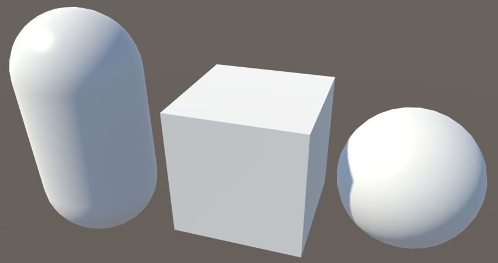
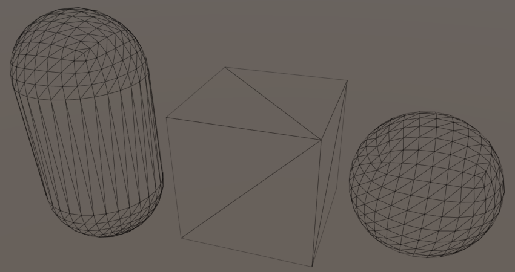
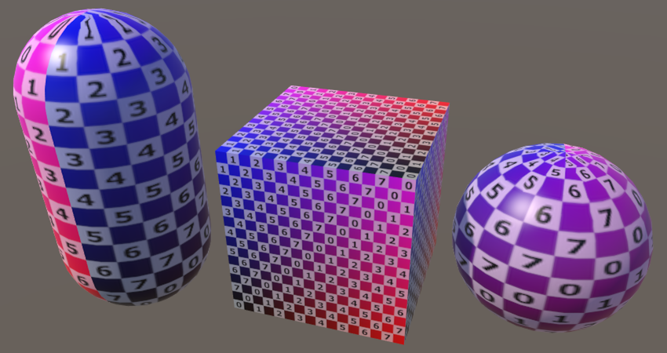
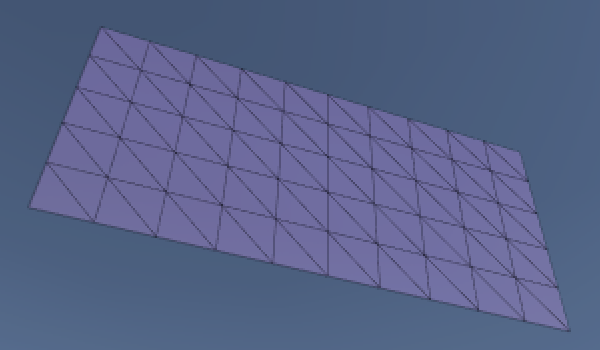
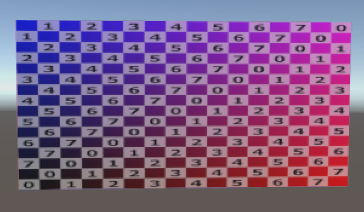

# Unity Mesh基础系列（一）生成网格（程序生成）

[原文地址](https://catlikecoding.com/unity/tutorials/procedural-grid/)

[译文地址](https://mp.weixin.qq.com/s/jIKG2rpNkgVQx2BIWjmYvg)


>本文主要内容：
>
1、创建一个点阵网格
2、用协程分析点阵网格的位置
3、用三角形定义表面
4、自动生成法线
5、增加纹理坐标和切线

## **1 渲染事物**

Unity是基于mesh去做渲染的，也就是说你想在Unity里看见东西的话，就必须要使用mesh。它可以来自于其他软件制作的3D模型进行导入，可以是由代码动态生成出来的，也可以是一个sprite、UI元素或者是粒子系统，这些统统都是要用到mesh的，就连一些屏幕的后处理特效都需要使用mesh来渲染。

所以，那么到底Mesh是什么呢？从概念上讲，mesh是图形硬件用来绘制复杂事物的的框架。它至少包含一个顶点集合（这些顶点是三维空间中的一些坐标，）以及连接这些点的一组三角形（最基本的2D形状）。这些三角形集合在一起就构成任何mesh所代表的表面形状。

由于三角形是平的，是直线的边，所以它们可以用来完美地显示平面和直线的事物，就比如一个立方体的表面。而曲面或圆曲面只能用许多小三角形来逼近的模拟。如果三角形足够小（比如小于一个像素），那么你就看不出来这是一个近似的模拟值。但通常，这是在当下的硬件设备上是不可能的，因为性能不允许。所以你看到的3D物体表面总是会出现一定程度的锯齿状。



*Unity's default capsule, cube, and sphere, shaded vs. wireframe.*


> 怎么显示 线框模式？（Wireframe）
>
> 在Scene的视窗下面有个下拉菜单，点击之后可以在Scene的视窗里看到不同的渲染模式。

如果你想用一个GameObject展示一个3D的模型，那么它必须要两个components才可以。第一个是mesh filter，它决定了你想展示那个mesh；第二个是mesh renderer，它决定了你应该如何渲染mesh，比如使用什么材质球，是否接受阴影或者投影等等。


> 为什么materials是复数的？
>
> mesh renderer可以有多个materials。这主要用于绘制具有多个独立三角形集的mesh，称为subMesh。这些subMesh来自于导入的3D模型，本教程将不讨论这些内容。

通过调整mesh的material，可以完全改变mesh的表现。Unity的默认材料是纯白色的，你可以通过 _Assets Create Material来创建一个新的材质球，并将其拖到游戏对象上来替换它。新的材质球使用的是Unity的标准着色器，它会开放一组设置参数来让你调整不同的视觉效果。

向mesh中添加大量细节的一个快速方法是提供一个albedo maps。这是一个纹理贴图，用来表示一个材质球的基本颜色。纹理贴图只有长和宽2个维度，而mesh往往是一个三维物体，所以要达到这个目的，我们需要知道如何将这个纹理投射到mesh的三角形上。这其实是通过向顶点添加二维纹理坐标来完成的。

纹理空间的两个维度被称为U和V，这就是为什么它们被称为UV坐标。这些坐标通常位于(0，0)和(1，1)之间，覆盖整个纹理图。根据纹理设置，该范围外的坐标要么被收紧，要么导致tiled。




*A UV test texture applied to Unity's meshes.*

## **2 创建顶点网格**

所以除了导入3D模型，以及使用Unity默认的之外，我们怎么创建自己的Mesh呢。这里我们就开始生产一些简单的规则的网格试一试。生成的网格将由单位长度的方形Tiled(四边形)组成。

创建一个新的C#脚本，并将其转换为具有水平和垂直大小的网格组件。

```cs
using UnityEngine;
using System.Collections;

public class Grid : MonoBehaviour {

	public int xSize, ySize;
}
```

为什么要在代码里加 using System.Collections; ？

这段代码里并不需要这个using，但是稍后我们需要使用到coroutine。

当我们将这个组件添加到游戏对象中时，我们也需要给它一个mesh filter 和一个 mesh renderer。这里有个快捷的方式，向我们的类添加一个属性，以便使Unity自动为我们添加它们。

```cs
[RequireComponent(typeof(MeshFilter), typeof(MeshRenderer))]
public class Grid : MonoBehaviour {

	public int xSize, ySize;
}
```

现在你可以创建一个新的 空的game object，将grid 组件添加到它上面，它就会自动添加其他两个组件。设置mesh renderer 的材质，让mesh filter保持 mesh 未引用状态。这里我们把grid的大小设为10和5。


当脚本Awake的时候，我们就让它自动生成这些网格。Awake是在Unity Editor点击播放的时候调用的。

```cs
private void Awake () {
		Generate();
	}
```

首先我们需要先知道所有顶点的位置，所以可以把三角形留到后面再处理。保存顶点，就需要持有一个三维的矢量的阵列来存储点，顶点的数量则取决于grid的大小。我们需要一个顶点在每个四边形的四个角上，但相邻的四边形可以共享相同的顶点。鉴于此，我们多定义一个维度的长度，好过每个顶点都发生冗余。

即 一个2X4的矩形，我们其实只要定义3X5的顶点即可，如下。

**(#x+1)(#y+1)**


顶点维度定义如下：

```cs
private Vector3[] vertices;

	private void Generate () {
		vertices = new Vector3[(xSize + 1) * (ySize + 1)];
	}
```

顶点定义了之后，它只是数据，并不能直观的看到，这里我们可以让这些顶点可视化，这样我们就可以检查它们的位置是否正确。而方法就是通过添加一个OnDrawGizmos方法，并在场景视图中为每个顶点绘制一个小的黑色球体。

```
	private void OnDrawGizmos () {
		Gizmos.color = Color.black;
		for (int i = 0; i < vertices.Length; i++) {
			Gizmos.DrawSphere(vertices[i], 0.1f);
		}
	}
```


在游戏模式下，我们只看到了一个黑点的球体。这是因为我们还没有给顶点设置位置，所以它们重叠在一起了。我们必须遍历所有的位置，给它们设置好坐标。

```cs
private void Generate () {
		vertices = new Vector3[(xSize + 1) * (ySize + 1)];
		for (int i = 0, y = 0; y <= ySize; y++) {
			for (int x = 0; x <= xSize; x++, i++) {
				vertices[i] = new Vector3(x, y);
			}
		}
	}
```

现在我们能看到了顶点，但是它们放置的顺序是不可见的。这里有两个方法，第一我们可以用不同的颜色来区分，第二我们也可以通过使用协程来减缓这一生成的过程。这就是为什么前面的脚本中包括使用System.Collection的原因。

```cs
private void Awake () {
		StartCoroutine(Generate());
	}

	private IEnumerator Generate () {
		WaitForSeconds wait = new WaitForSeconds(0.05f);
		vertices = new Vector3[(xSize + 1) * (ySize + 1)];
		for (int i = 0, y = 0; y <= ySize; y++) {
			for (int x = 0; x <= xSize; x++, i++) {
				vertices[i] = new Vector3(x, y);
				yield return wait;
			}
		}
	}
```


## **3 创建Mesh**

到这里我们已经能知道顶点的位置以及顺序是正确的了，那么我们就可以处理实际的mesh了。除了在我们自己的组件中保存对它的引用之外，还必须将它分配给mesh filter才行。一旦处理好了顶点，就可以把它们交给网格了。

```cs
	private Mesh mesh;

	private IEnumerator Generate () {
		WaitForSeconds wait = new WaitForSeconds(0.05f);
		
		GetComponent<MeshFilter>().mesh = mesh = new Mesh();
		mesh.name = "Procedural Grid";

		vertices = new Vector3[(xSize + 1) * (ySize + 1)];
		…
		mesh.vertices = vertices;
	}
```


这样，我们就能从mesh Filter里看到mesh的实例了。但是我们还不能在游戏里看到它，因为我们还没有给它定义三角形。

三角形是通过一系列顶点索引来定义的。由于每个三角形有三个点，三个连续的索引就描述了一个三角形。让我们从一个三角形开始。

```cs
	private IEnumerator Generate () {
		…

		int[] triangles = new int[3];
		triangles[0] = 0;
		triangles[1] = 1;
		triangles[2] = 2;
		mesh.triangles = triangles;
	}
```

我们现在有一个三角了，但是要注意，这里我们使用的三个点是一条直线上的。这会导致程序产生一个不可见的退化三角形，其实就是一条直线。这里前两个顶点很好，但是最后一个我们应该跳到下一行的第一个顶点才对。

```cs
		triangles[0] = 0;
		triangles[1] = 1;
		triangles[2] = xSize + 1;
```

这确实给了我们一个三角形，但它只从一个方向可见。在这种情况下，只有当观察到Z轴的相反方向时，它才是可见的。因此，你可能需要旋转视图的方向才能看到它。

三角形的哪一边可见是由它的顶点顺序的时钟方向决定的。默认情况下，如果它们按顺时针方向排列，则三角形被认为是前向的和可见的，逆时针方向的三角形会被丢弃。另外我们也不会花时间渲染对象的内部，因为这些东西通常不会被看到。


因此，当我们向下看Z轴时，要使三角形出现，我们必须改变其顶点被遍历的顺序。我们可以通过交换最后两个索引来实现。

```
		triangles[0] = 0;
		triangles[1] = xSize + 1;
		triangles[2] = 1;
```


现在有了一个三角形了，位置我们网格的第一块瓷砖的一半位置。为了能覆盖整个瓷砖，我们所需要的第二个三角形。

```cs
		int[] triangles = new int[6];
		triangles[0] = 0;
		triangles[1] = xSize + 1;
		triangles[2] = 1;
		triangles[3] = 1;
		triangles[4] = xSize + 1;
		triangles[5] = xSize + 2;
```


由于这些三角形共享两个顶点，所以我们可以将其简化为四行代码，只显式地提到每个顶点索引一次。

```cs
		triangles[0] = 0;
		triangles[3] = triangles[2] = 1;
		triangles[4] = triangles[1] = xSize + 1;
		triangles[5] = xSize + 2;
```


这样每个三角形的顶点都用一行代码，效率太低了，我们可以通过将整个第一行瓷砖转换成一个循环来创建整个第一行。但按照我们现在的代码，在遍历顶点和三角形索引时，我们必须同时追踪这两个数据指标才行。这里我们可以把创建顶点的协程去掉，然后加载创建tiled的表现上。

```cs
		int[] triangles = new int[xSize * 6];
		for (int ti = 0, vi = 0, x = 0; x < xSize; x++, ti += 6, vi++) {
			triangles[ti] = vi;
			triangles[ti + 3] = triangles[ti + 2] = vi + 1;
			triangles[ti + 4] = triangles[ti + 1] = vi + xSize + 1;
			triangles[ti + 5] = vi + xSize + 2;
			yield return wait;
		}
```

代表顶点的小圆点现在立即出现了，所有的三角形都在短暂的等待后立即出现。要看到这些块一个一个地出现，我们必须在每次迭代之后更新mesh，而不是只在循环之后更新才行。

```cs
			mesh.triangles = triangles;
			yield return wait;
```

现在，通过将单循环转换为一个双循环来填充整个grid 。

请注意，移动到下一行的时候，需要将顶点索引递增一下，因为每一行有一个顶点比Tiles的索引多一个。

```cs
		int[] triangles = new int[xSize * ySize * 6];
		for (int ti = 0, vi = 0, y = 0; y < ySize; y++, vi++) {
			for (int x = 0; x < xSize; x++, ti += 6, vi++) {
				…
			}
		}
```


正如你所看到的，整个网格现在充满了三角形，一次一行。如果你对此该效果满意了，就可以删除所有协程代码，mesh会被立即创建出来的。

下面给一下完成的代码展示：

```cs
	private void Awake () {
		Generate();
	}

	private void Generate () {
		GetComponent<MeshFilter>().mesh = mesh = new Mesh();
		mesh.name = "Procedural Grid";

		vertices = new Vector3[(xSize + 1) * (ySize + 1)];
		for (int i = 0, y = 0; y <= ySize; y++) {
			for (int x = 0; x <= xSize; x++, i++) {
				vertices[i] = new Vector3(x, y);
			}
		}
		mesh.vertices = vertices;

		int[] triangles = new int[xSize * ySize * 6];
		for (int ti = 0, vi = 0, y = 0; y < ySize; y++, vi++) {
			for (int x = 0; x < xSize; x++, ti += 6, vi++) {
				triangles[ti] = vi;
				triangles[ti + 3] = triangles[ti + 2] = vi + 1;
				triangles[ti + 4] = triangles[ti + 1] = vi + xSize + 1;
				triangles[ti + 5] = vi + xSize + 2;
			}
		}
		mesh.triangles = triangles;
	}
```

> 为什么不用正方形作为基础绘制单元？
>
> 当我们创建一个扁平的矩形平面的时候，我们只需要两个三角形就足够了。这是绝对没问题的。但更多更复杂的结构的由最基础的几何面来定义才能更好的控制和表现。


## **4 生成附加顶点数据**

我们目前实现的方案是在一种极端的情况下完成的，因为我们的mesh没有给出任何的法线。默认的法线方向是 **(0, 0, 1)** ，但这不一定是我们想要的。

> 法线是如何作用的？
>
> 法线是一个垂直于表面的矢量。我们总是使用单位长度的法线，并用它们指向表面的外部，从而区分表面的内外。

法线还可以用来确定光线击中表面的角度(如果有的话)。它的具体使用方式取决于shader。

由于三角形总是在一个平面上的，所以不需要提供的单独的法线信息。但是，我们可以通过提供法线来达到一些“作弊”行为。在现实中，顶点是没有法线的，但三角形有。但是，通过在顶点上附加自定义法线并在它们之间进行三角插值，就可以假装我们有一个平滑的曲面而不是一堆平坦的三角形。这种错觉是能够欺骗普通人的感官的，但是一些Mesh的锐利轮廓可能降低这一表现。

法线是每个顶点单独定义的，所以我们必须填充另外一个向量数组。或者，我们可以要求网格根据其三角形来确定法线本身。这次我们偷下懒。

```cs
	private void Generate () {
		…
		mesh.triangles = triangles;
		mesh.RecalculateNormals();
	}
```

> 法线是怎么计算的？
Mesh.RecalculateNormals 计算每个顶点的法线是通过计算哪些三角形与该顶点相连，先确定这些平面三角形的法线，对它们进行平均，最后对结果进行归一化处理。




*Without vs. with normals.*

接下来是UV坐标。你肯定已经在想了，为什么它使用的材料具有albedo纹理，Mesh当前还是只有一个颜色呢。这是有原因的，因为如果我们自己不提供UV坐标，那么它们都是默认的零。

要使纹理适合我们的整个网格，只需将顶点的位置除以网格尺寸即可。

```cs
		vertices = new Vector3[(xSize + 1) * (ySize + 1)];
		Vector2[] uv = new Vector2[vertices.Length];
		for (int i = 0, y = 0; y <= ySize; y++) {
			for (int x = 0; x <= xSize; x++, i++) {
				vertices[i] = new Vector3(x, y);
				uv[i] = new Vector2(x / xSize, y / ySize);
			}
		}
		mesh.vertices = vertices;
		mesh.uv = uv;
```


*Incorrect UV coordinates, clamping vs. wrapping texture.*

纹理现在显示了，但它没有覆盖整个mesh。它的确切外观取决于纹理的包装模式是设置为clamp 还是repeat。这是因为我们目前正在用整数除以整数，这会产生另一个整数。为了在整个网格中获得零到一之间的正确坐标，我们必须确保我们使用的是浮点数。

```cs
				uv[i] = new Vector2((float)x / xSize, (float)y / ySize);
```

纹理现在投射到整个mesh上了。由于我们已经将网格的大小设置为10乘5，纹理会显示为水平拉伸。这可以通过调整材质的贴图设置来抵消。通过将其设置为(2，1)，U坐标将加倍。如果纹理被设置为重复，那么我们将看到它的两个方形瓦片。




*Correct UV coordinates, tiling 1,1 vs. 2,1.*

另一种向表面添加更明显细节的方法是使用法线纹理。这个纹理上包含以颜色编码的法线向量。将它们应用到表面会产生比单用顶点法线更详细的光效应。


但只将这种材质球应用到我们的网格中会产生凸起，是不正确的。我们需要在网格中添加切线向量来正确地定位它们。

> 切线是如何作用的？
>
> 法线映射是在切线空间中定义的。这是一个在物体表面流动的三维空间。这种方法允许我们在不同的地方和方向应用相同的法线映射。

表面法线在这个空间上是向上的，但是哪条路是正确的呢？这是由切线定义的。理想情况下，这两个矢量之间的夹角为90°。它们的交叉积产生定义三维空间所需的第三个方向。

在现实中，角度往往不是90°，但结果仍然够好。所以切线是一个三维向量，但是Unity实际上使用了一个4D向量。它的第四个分量总是−1或1，用于控制第三切线空间维的方向--前向或后向。这方便对法线映射进行镜像，这种映射经常用于像人这样具有双边对称性三维模型中。

Unity的着色器执行此计算的方式要求我们使用−1。

因为我们是一个平面，所以所有的切线都指向相同的方向，也就是右边。

```cs
		vertices = new Vector3[(xSize + 1) * (ySize + 1)];
		Vector2[] uv = new Vector2[vertices.Length];
		Vector4[] tangents = new Vector4[vertices.Length];
		Vector4 tangent = new Vector4(1f, 0f, 0f, -1f);
		for (int i = 0, y = 0; y <= ySize; y++) {
			for (int x = 0; x <= xSize; x++, i++) {
				vertices[i] = new Vector3(x, y);
				uv[i] = new Vector2((float)x / xSize, (float)y / ySize);
				tangents[i] = tangent;
			}
		}
		mesh.vertices = vertices;
		mesh.uv = uv;
		mesh.tangents = tangents;
```


现在，你已经知道了如何创建一个简单的mesh，并使它看起来像是使用了很复杂的材质。mesh需要顶点位置和三角形，通常也需要UV坐标--最多四组（经常是切线）。其实你还可以添加顶点颜色，虽然Unity的标准着色器不使用它们。但你可以在自己创建的着色器里使用这些颜色，但这是另一个教程了。