# Unity Mesh基础系列（二）圆角立方体（构建）

[原文地址](https://catlikecoding.com/unity/tutorials/rounded-cube/)

[译文地址](https://mp.weixin.qq.com/s/fZmw-AIGpXz5AToChjA8Lw)

> 本篇文章主要内容：
>
> 创建一个具有无缝网格的立方体
> 将圆角边添加到立方体中。
> 定义法线
> 使用sub-mesh
> 创建自定义shader
> 合并初始的碰撞体

## **1 复合一个立方体**

上一篇我们讲了怎么生成一个2D的网格（grid），接下来我们就要看看怎么生成一个3D的结构。我们需要先来理解一些立方体，从概念上来说，它由六个2D面组成，通过不同的定位和旋转，从而封装了成了一个3D空间。我们可以通过创建六个网格的实例来完成这个任务。

我们的上一篇的网格是位于XY平面上，面对负Z方向。这其实就是立方体的-Z面。你可以复制网格，从而创建一个+Z面。只要设置它的Y旋转180°并重新定位它，使两面对齐即可。

-X和+X面的创建方式相同，但Y旋转为90°和270°。如果你愿意，你也可以为这些表面提供与Z 表面不同的xSize，但是它们的ySize必须匹配。这四个面必须对齐，才能形成一个封闭的环。

-Y和+Y面的X旋转为270°和90°.它们的xSize应该与Z面的xSize匹配，它们的ySize应该匹配X Faces的xSize。

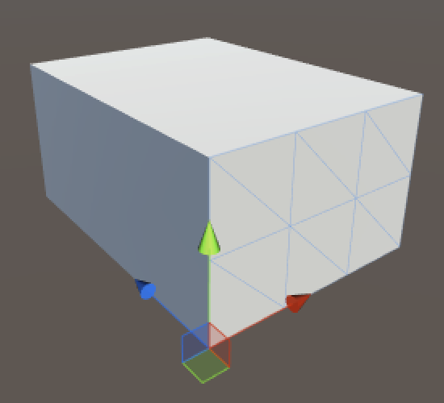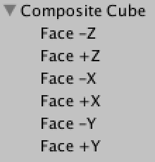

这样的方式可以完成一个立方体，它由六个独立的网格组成。虽然它看起来没有问题，并且是一个很好的参照，但其实它并不实用。我们可以通过网格来组合Mesh，但是我们也可以一次性创建整个立方体。

## **2 创建立方体顶点集合**

为了区分之前的2D mesh，我们需要新建一个component 脚本来完成我们的Cube的功能逻辑。但是也不是需要完全重写生成的逻辑，2D和3D之间的区别仅仅就是多一个维度而已。顶点集合以及三角形集合都是一样的，所以我们只需要对上一章节的代码做一点点变更，增加一个zSize即可。并且这一次，我们还是加上gizmos 来可视化这些表现。

```cs
using UnityEngine;
using System.Collections;

[RequireComponent(typeof(MeshFilter), typeof(MeshRenderer))]
public class Cube : MonoBehaviour {

	public int xSize, ySize, zSize;

	private Mesh mesh;
	private Vector3[] vertices;

	private void Awake () {
		StartCoroutine(Generate());
	}

	private IEnumerator Generate () {
		GetComponent<MeshFilter>().mesh = mesh = new Mesh();
		mesh.name = "Procedural Cube";
		WaitForSeconds wait = new WaitForSeconds(0.05f);

		yield return wait;
	}

	private void OnDrawGizmos () {
		if (vertices == null) {
			return;
		}
		Gizmos.color = Color.black;
		for (int i = 0; i < vertices.Length; i++) {
			Gizmos.DrawSphere(vertices[i], 0.1f);
		}
	}
}
```

现在，您可以向场景中添加一个新的游戏对象，并通过添加此组件将其转换为一个立方体。或替换现有对象的网格组件。

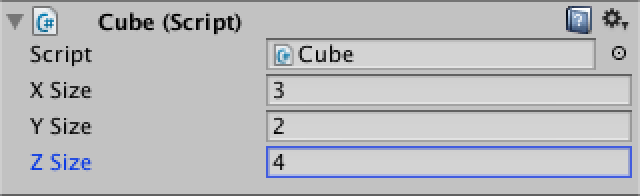

在添加立方体的顶点之前，我们必须要先知道它有多少个。前面我们其实已经知道单个面所需的顶点数量了。是：

(#x+1)(#y+1)

所以我们其实只要把6个面的相加就能得到所有的顶点数量。

**2((#x+1)(#y+1)+(#x+1)(#z+1)+(#y+1)(#z+1))**

但这其实并不正确。因为当不同的表面彼此接触的时候，会有一些顶点重合，这就会导致多余的顶点出现。这样的结果就是立方体的每个角点都是三倍的，而沿着它的边的所有顶点都是双倍的。

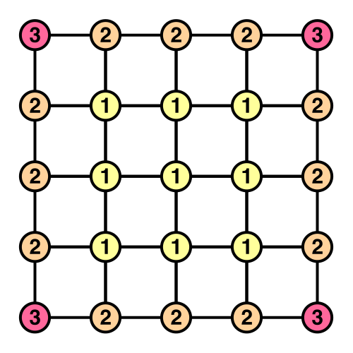

但这不一定是个问题。事实上，顶点重复是非常常见的，它会被用来在一个有法线的Mesh中创建锋利的边缘。因此，我们确实可以创建完全独立的六个面，只是数据组合在一个数组中而已。

但这不是我们想要的结果，因为我们已经知道如何去创建网格了。所以这一次，我们让我们的的立方体不会有重复的顶点。

那么最终的顶点数量究竟是多少呢？让我们把它按类型分吧类。

首先，我们有八个角点，这很简单。然后我们有十二条边，每个方向四条。由于我们不包括角，每个边有一个数量的顶点相等于相应的大小减去1。或者，把它看作X，Y和Z边的四组。

4(#x+#y+#z?3)

剩下的顶点是那些留在表面上的顶点了。这其实相当于一个具有重复顶点的立方体，它的大小减少了两个。

也就是：

2((#x?1)(#y?1)+(#x?1)(#z?1)+(#y?1)(#z?1))

那么最后我们最终得到了所有顶点的数量：

```cs
	private IEnumerator Generate () {
		GetComponent<MeshFilter>().mesh = mesh = new Mesh();
		mesh.name = "Procedural Cube";
		WaitForSeconds wait = new WaitForSeconds(0.05f);

		int cornerVertices = 8;
		int edgeVertices = (xSize + ySize + zSize - 3) * 4;
		int faceVertices = (
			(xSize - 1) * (ySize - 1) +
			(xSize - 1) * (zSize - 1) +
			(ySize - 1) * (zSize - 1)) * 2;
		vertices = new Vector3[cornerVertices + edgeVertices + faceVertices];

		yield return wait;
	}
```

定位第一面行的顶点与定位网格的第一行完全一样。

```cs
		vertices = new Vector3[cornerVertices + edgeVertices + faceVertices];

		int v = 0;
		for (int x = 0; x <= xSize; x++) {
			vertices[v++] = new Vector3(x, 0, 0);
			yield return wait;
		}
```

> 为什么访问数组的时候要增加v？
>
> 其思想是，每次我们给数组分配一个顶点时，顶点索引就会增加。规则是，无论何时设置一个位置，都应该用顶点[v++]来完成，并且永远不要用顶点[v]。这样，就不必担心V在其他地方递增。当然，其实也可以在与循环迭代器相同的位置增加v。只要你始终如一，结果就是正确的。这里只是在展示一种不同的方法而已。

然后就有意思了，继续第二面的第一行，以此类推，通过循环四次，使用不同的范围和位置，创建一个方形的顶点环。

```cs
		for (int x = 0; x <= xSize; x++) {
			vertices[v++] = new Vector3(x, 0, 0);
			yield return wait;
		}
		for (int z = 1; z <= zSize; z++) {
			vertices[v++] = new Vector3(xSize, 0, z);
			yield return wait;
		}
		for (int x = xSize - 1; x >= 0; x--) {
			vertices[v++] = new Vector3(x, 0, zSize);
			yield return wait;
		}
		for (int z = zSize - 1; z > 0; z--) {
			vertices[v++] = new Vector3(0, 0, z);
			yield return wait;
		}
```

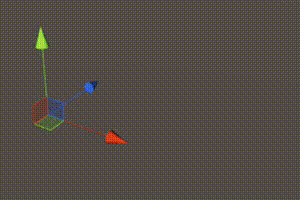

我们可以通过在Y方向上重复环的位置，直到到达立方体的高度。

```cs
		int v = 0;
		for (int y = 0; y <= ySize; y++) {
			for (int x = 0; x <= xSize; x++) {
				vertices[v++] = new Vector3(x, y, 0);
				yield return wait;
			}
			for (int z = 1; z <= zSize; z++) {
				vertices[v++] = new Vector3(xSize, y, z);
				yield return wait;
			}
			for (int x = xSize - 1; x >= 0; x--) {
				vertices[v++] = new Vector3(x, y, zSize);
				yield return wait;
			}
			for (int z = zSize - 1; z > 0; z--) {
				vertices[v++] = new Vector3(0, y, z);
				yield return wait;
			}
		}
```

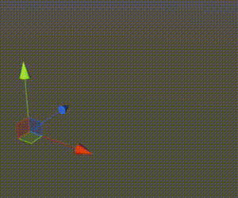

完成了这些之后，我们必须在顶部和底部盖上盖子。就像给一个普通的网格填坑一样。

```cs
		for (int z = 1; z < zSize; z++) {
			for (int x = 1; x < xSize; x++) {
				vertices[v++] = new Vector3(x, ySize, z);
				yield return wait;
			}
		}
		for (int z = 1; z < zSize; z++) {
			for (int x = 1; x < xSize; x++) {
				vertices[v++] = new Vector3(x, 0, z);
				yield return wait;
			}
		}
```

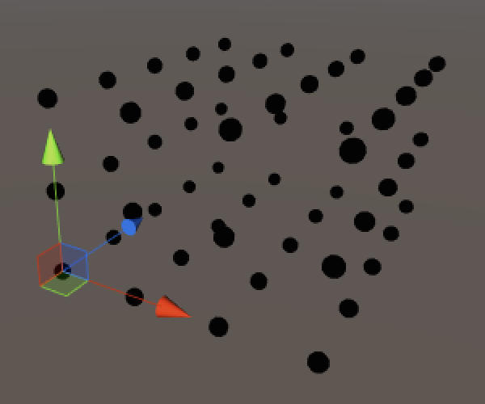

## **3 添加三角形**

既然顶点是正确的位置，并且我们也熟悉它们的排列顺序，接下来就可以继续讨论三角形了。

为了准备这个，和前面教程一样，我们可以删除协程的内，并添加了创建顶点和三角形的单独方法。当然，顶点需要赋值到mesh里。

```cs
	private void Awake () {
		Generate();
	}

	private void Generate () {
		GetComponent<MeshFilter>().mesh = mesh = new Mesh();
		mesh.name = "Procedural Cube";
		CreateVertices();
		CreateTriangles();
	}

	private void CreateVertices () {
		…
		
		mesh.vertices = vertices;
	}

	private void CreateTriangles () {
	}
```

创建单个正方形与上一章的网格完全相同。但由于我们会在多个地方创建它，所以我们单独弄一个方法出来更方便一些。

```cs
	private static int
	SetQuad (int[] triangles, int i, int v00, int v10, int v01, int v11) {
		triangles[i] = v00;
		triangles[i + 1] = triangles[i + 4] = v01;
		triangles[i + 2] = triangles[i + 3] = v10;
		triangles[i + 5] = v11;
		return i + 6;
	}
```

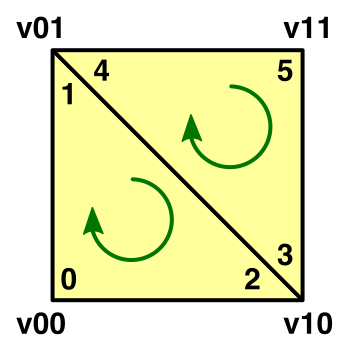

> 为什么使用三角参数？
>
> 虽然我们给立方体对象的是一个 vertices 字段，但是对于三角形而言，不能这么做。因此，我们必须将它作为参数传递给SetQuad方法。这就是为什么这个方法可以是静态的。当然，其实你也可以在对象级别存储三角形，但请注意，后面要用的是传参数的方法。

> 为什么要返回三角形的Index？
>
> 由于同样的原因，我在访问数组时增加了顶点索引。这样，每次设置四边形时，只要将结果分配给索引，就可以完成了。

与顶点不同的是，三角形的数量正好等于六个面三角形的总和。至于它们是否使用共享顶点并不重要，也不影响。

```cs
	private void CreateTriangles () {
		int quads = (xSize * ySize + xSize * zSize + ySize * zSize) * 2;
		int[] triangles = new int[quads * 6];
		mesh.triangles = triangles;
	}
```

创建第一个三角形的方式仍然与上一章的网格相同。到目前为止，唯一的区别是，下一行中顶点的偏移量等于一个完整的顶点环。

```cs
	private void CreateTriangles () {
		int quads = (xSize * ySize + xSize * zSize + ySize * zSize) * 2;
		int[] triangles = new int[quads * 6];
		int ring = (xSize + zSize) * 2;
		int t = 0, v = 0;

		for (int q = 0; q < xSize; q++, v++) {
			t = SetQuad(triangles, t, v, v + 1, v + ring, v + ring + 1);
		}
		
		mesh.triangles = triangles;
	}
```

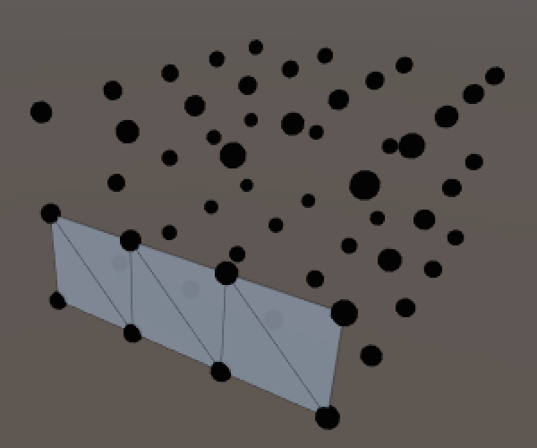

要对一个环用三角形表示，让我们索性天真一点，延长整个环的长度看看。

```cs
		for (int q = 0; q < ring; q++, v++) {
			t = SetQuad(triangles, t, v, v + 1, v + ring, v + ring + 1);
		}
```

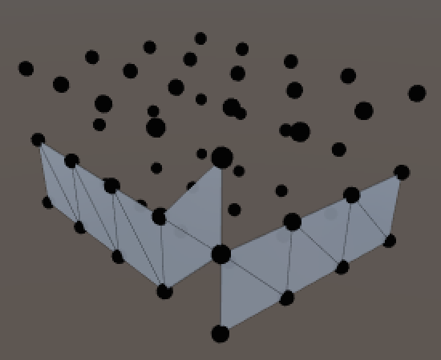

结果看起来是对的，当然要除了最后一个正方形。它的第二个和第四个顶点需要倒回到环的开始才对。所以从循环中提取出来，单独设置。

```cs
		for (int q = 0; q < ring - 1; q++, v++) {
			t = SetQuad(triangles, t, v, v + 1, v + ring, v + ring + 1);
		}
		t = SetQuad(triangles, t, v, v - ring + 1, v + ring, v + 1);
```

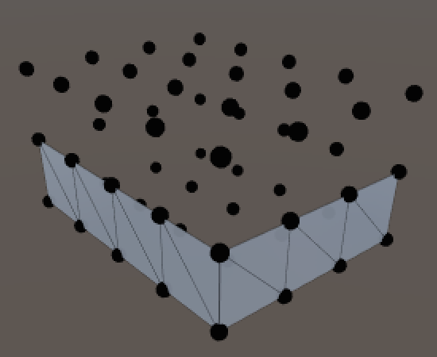

要对所有环进行三角化，再次简单地沿着Y重复这个过程。注意，在每个环之后，需要增加顶点索引，因为我们的环环要短一步。

```cs
		for (int y = 0; y < ySize; y++, v++) {
			for (int q = 0; q < ring - 1; q++, v++) {
				t = SetQuad(triangles, t, v, v + 1, v + ring, v + ring + 1);
			}
			t = SetQuad(triangles, t, v, v - ring + 1, v + ring, v + 1);
		}
```

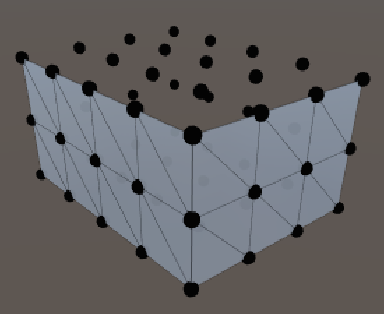

然而不幸的是，顶部和底部的表面并不能那么直接处理。它们的顶点布局就像一个被环包围的网格一样。

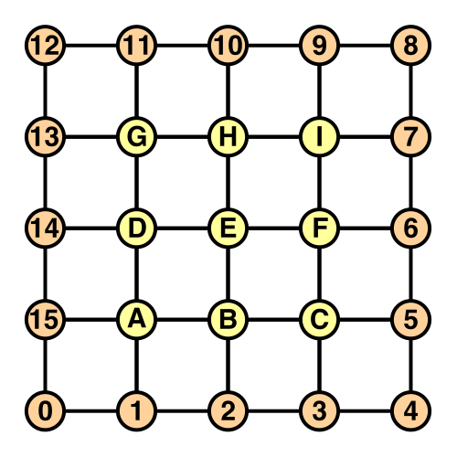

让我们从最上面开始吧，给它单独的方法。

```cs
	private void CreateTriangles () {
		…

		t = CreateTopFace(triangles, t, ring);
		mesh.triangles = triangles;
	}
```

第一行遵循熟悉的模式。这是因为内部网格的第一行是在螺旋结束后直接添加的。但最后一个正方形的第四个顶点是不同的，因为那是环向上弯曲的地方。

```cs
	private int CreateTopFace (int[] triangles, int t, int ring) {
		int v = ring * ySize;
		for (int x = 0; x < xSize - 1; x++, v++) {
			t = SetQuad(triangles, t, v, v + 1, v + ring - 1, v + ring);
		}
		t = SetQuad(triangles, t, v, v + 1, v + ring - 1, v + 2);
		
		return t;
	}
```

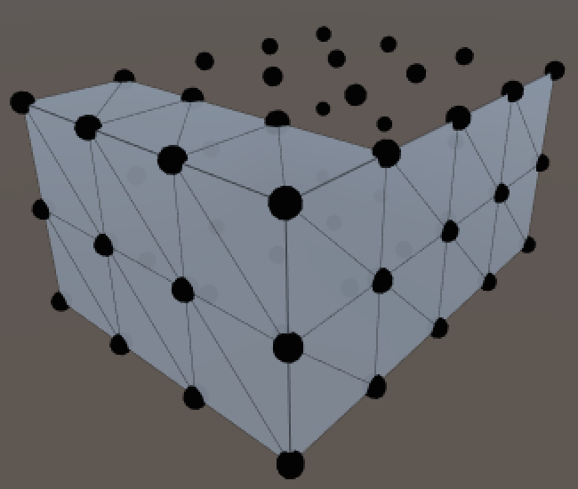

对于下一行，它变得更加复杂。跟踪行的最小顶点索引（位于环上）很有用。要跟踪的另一个索引是中间部分，即网格。

```cs
		…
		
		int vMin = ring * (ySize + 1) - 1;
		int vMid = vMin + 1;

		t = SetQuad(triangles, t, vMin, vMid, vMin - 1, vMid + xSize - 1);
		
		return t;
```

行的中间部分很像一个规则的网格。

```cs
		t = SetQuad(triangles, t, vMin, vMid, vMin - 1, vMid + xSize - 1);
		for (int x = 1; x < xSize - 1; x++, vMid++) {
			t = SetQuad(
				triangles, t,
				vMid, vMid + 1, vMid + xSize - 1, vMid + xSize);
		}
```

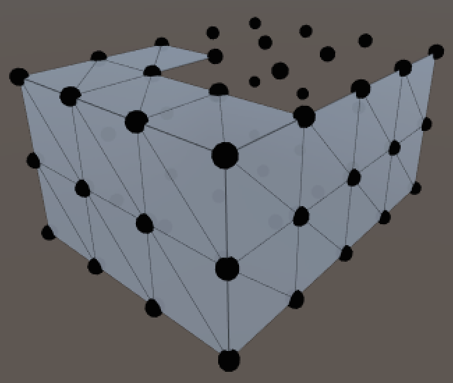

行的最后一个正方形必须再一次处理外环，所以让我们也追踪最大顶点。

```cs
		int vMin = ring * (ySize + 1) - 1;
		int vMid = vMin + 1;
		int vMax = v + 2;

		t = SetQuad(triangles, t, vMin, vMid, vMin - 1, vMid + xSize - 1);
		for (int x = 1; x < xSize - 1; x++, vMid++) {
			t = SetQuad(
				triangles, t,
				vMid, vMid + 1, vMid + xSize - 1, vMid + xSize);
		}
		t = SetQuad(triangles, t, vMid, vMax, vMid + xSize - 1, vMax + 1);
```

这其实可以转换成一个循环来处理除最后一行之外的所有事务。每次迭代，中间和最大顶点索引都需要增加。由于环的取向，最小顶点索引反而下降。

```cs
		for (int z = 1; z < zSize - 1; z++, vMin--, vMid++, vMax++) {
			t = SetQuad(triangles, t, vMin, vMid, vMin - 1, vMid + xSize - 1);
			for (int x = 1; x < xSize - 1; x++, vMid++) {
				t = SetQuad(
					triangles, t,
					vMid, vMid + 1, vMid + xSize - 1, vMid + xSize);
			}
			t = SetQuad(triangles, t, vMid, vMax, vMid + xSize - 1, vMax + 1);
		}
```

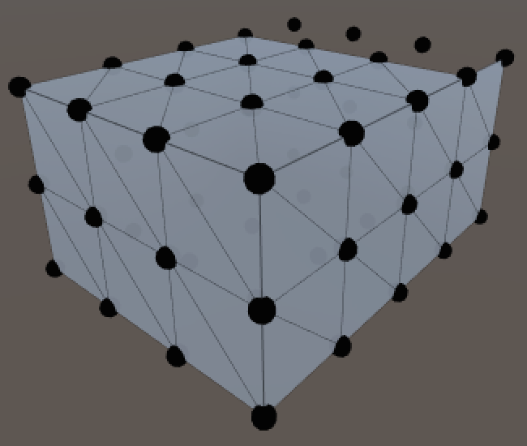

到这里，我们需要介绍顶部顶点索引顺序，然后使用它来设置最后一行的第一个正方形。

```cs
		int vTop = vMin - 2;
		t = SetQuad(triangles, t, vMin, vMid, vTop + 1, vTop);
```

然后在行中间循环。

```cs
		int vTop = vMin - 2;
		t = SetQuad(triangles, t, vMin, vMid, vTop + 1, vTop);
		for (int x = 1; x < xSize - 1; x++, vTop--, vMid++) {
			t = SetQuad(triangles, t, vMid, vMid + 1, vTop, vTop - 1);
		}
```

最后一个正方形

```cs
		int vTop = vMin - 2;
		t = SetQuad(triangles, t, vMin, vMid, vTop + 1, vTop);
		for (int x = 1; x < xSize - 1; x++, vTop--, vMid++) {
			t = SetQuad(triangles, t, vMid, vMid + 1, vTop, vTop - 1);
		}
		t = SetQuad(triangles, t, vMid, vTop - 2, vTop, vTop - 1);
```

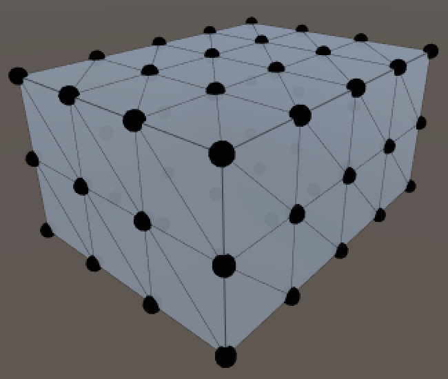

底面使用的方法与顶面略有不同，因此也给它一个单独方法。

```cs
	private void CreateTriangles () {
		…

		t = CreateTopFace(triangles, t, ring);
		t = CreateBottomFace(triangles, t, ring);
		mesh.triangles = triangles;
	}
```

底面和顶面有一些细微的不同之处，即顶点索引不同，这会使得第一行稍微复杂一些。

我们还必须改变顶点的时钟方向，使三角形面朝下而不是向上。当然还要确保三角形对角线和顶面指向相反的方向，所以这是所有的三角面了。

```cs
	private int CreateBottomFace (int[] triangles, int t, int ring) {
		int v = 1;
		int vMid = vertices.Length - (xSize - 1) * (zSize - 1);
		t = SetQuad(triangles, t, ring - 1, vMid, 0, 1);
		for (int x = 1; x < xSize - 1; x++, v++, vMid++) {
			t = SetQuad(triangles, t, vMid, vMid + 1, v, v + 1);
		}
		t = SetQuad(triangles, t, vMid, v + 2, v, v + 1);

		int vMin = ring - 2;
		vMid -= xSize - 2;
		int vMax = v + 2;

		for (int z = 1; z < zSize - 1; z++, vMin--, vMid++, vMax++) {
			t = SetQuad(triangles, t, vMin, vMid + xSize - 1, vMin + 1, vMid);
			for (int x = 1; x < xSize - 1; x++, vMid++) {
				t = SetQuad(
					triangles, t,
					vMid + xSize - 1, vMid + xSize, vMid, vMid + 1);
			}
			t = SetQuad(triangles, t, vMid + xSize - 1, vMax + 1, vMid, vMax);
		}

		int vTop = vMin - 1;
		t = SetQuad(triangles, t, vTop + 1, vTop, vTop + 2, vMid);
		for (int x = 1; x < xSize - 1; x++, vTop--, vMid++) {
			t = SetQuad(triangles, t, vTop, vTop - 1, vMid, vMid + 1);
		}
		t = SetQuad(triangles, t, vTop, vTop - 1, vMid, vTop - 2);
		
		return t;
	}
```

## **4 圆角化立方体**

真正的立方体不会总是那么四方四正的。那么现在我们就入活本篇的主题，圆角立方体。把刚才的类重命名一下 ，改为RoundedCube。Unity会自动追踪到你改名的脚本，但如果没有追踪到的话，你只需要把脚本重新拖拽到刚才的gameobject上即可。

当然，我们还是要控制一下圆角度，这里我们再定义一个 roundness 的字段，用来表示圆角的程度。建议值设置为1到最小维度一半的大小。

```cs
public class RoundedCube : MonoBehaviour {

	public int xSize, ySize, zSize;
	public int roundness;
	
	…
}
```

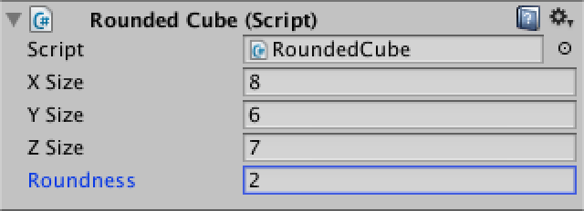

还记得之前让Unity自动计算的法线吗？这一次我们一样可以让Unity自己来计算。但是，Unity计算出来的是一个平均值，可能与我们想要的圆角度的表现不太契合，所以这次我们就自己来计算法线，这样会得到更好的表现效果。那么第一步就是，先增加一个 normals 数组。

```cs
	private Vector3[] normals;

	private void CreateVertices () {
		…
		vertices = new Vector3[cornerVertices + edgeVertices + faceVertices];
		normals = new Vector3[vertices.Length];

		…

		mesh.vertices = vertices;
		mesh.normals = normals;
	}
```

同样的，我们可以加上 OnDrawGizmos ，来显示法线。

```cs
	private void OnDrawGizmos () {
		if (vertices == null) {
			return;
		}
		for (int i = 0; i < vertices.Length; i++) {
			Gizmos.color = Color.black;
			Gizmos.DrawSphere(vertices[i], 0.1f);
			Gizmos.color = Color.yellow;
			Gizmos.DrawRay(vertices[i], normals[i]);
		}
	}
```

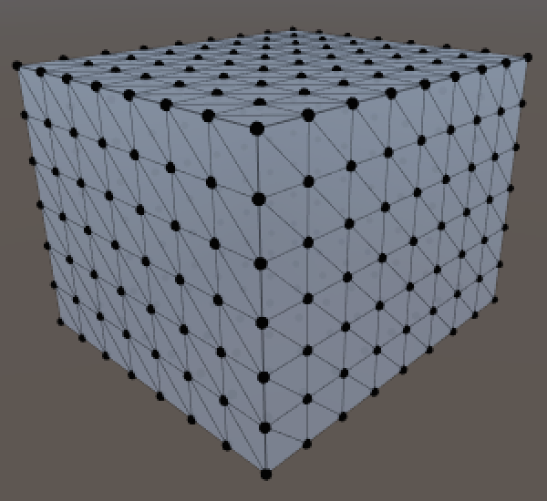

那么我们应该怎么通过立方体的顶点集合来正确计算出它们的法线呢？这里再创建一个单独的函数。

```cs
	private void CreateVertices () {
		…

		int v = 0;
		for (int y = 0; y <= ySize; y++) {
			for (int x = 0; x <= xSize; x++) {
				SetVertex(v++, x, y, 0);
			}
			for (int z = 1; z <= zSize; z++) {
				SetVertex(v++, xSize, y, z);
			}
			for (int x = xSize - 1; x >= 0; x--) {
				SetVertex(v++, x, y, zSize);
			}
			for (int z = zSize - 1; z > 0; z--) {
				SetVertex(v++, 0, y, z);
			}
		}
		for (int z = 1; z < zSize; z++) {
			for (int x = 1; x < xSize; x++) {
				SetVertex(v++, x, ySize, z);
			}
		}
		for (int z = 1; z < zSize; z++) {
			for (int x = 1; x < xSize; x++) {
				SetVertex(v++, x, 0, z);
			}
		}

		mesh.vertices = vertices;
		mesh.normals = normals;
	}

	private void SetVertex (int i, int x, int y, int z) {
		vertices[i] = new Vector3(x, y, z);
	}
```

可以这样想象一下，有一个较小的立方体浮动在我们的原始立方体内。这两个立方体的面之间的距离就等于我们配置的圆度值。你可以想象一个球被贴在这个小立方体的角上，它们的半径等于刚才的圆度值，所以内部立方体被牢牢地固定在原地了。对于外部立方体上的任意一点，在内部立方体上有一个离它最近的点。这样我们就可以用它来确定圆角立方体的法线向量了。

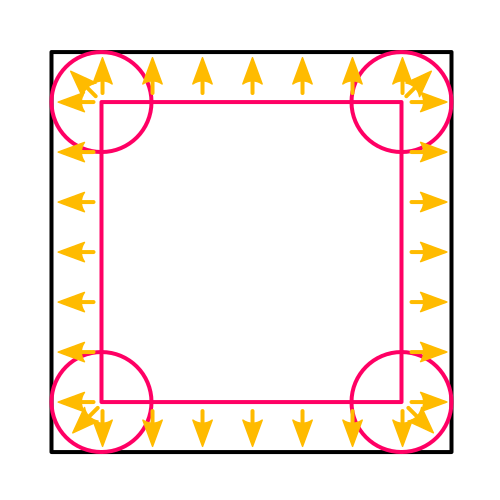

然后，圆角立方体的表面点可以从内部点开始，沿法线方向移动，其数量等于圆度值。下面是代码，但它还没有定位具体的内部点。

```cs
	private void SetVertex (int i, int x, int y, int z) {
		Vector3 inner = vertices[i] = new Vector3(x, y, z);

		normals[i] = (vertices[i] - inner).normalized;
		vertices[i] = inner + normals[i] * roundness;
	}
```

接下来我们要找出内在的点。首先检查X坐标。如果它小于圆度，那么它在内部立方体的左边，内部的X坐标就是圆度值。如果超出了立方体的X减去圆度值的大小，那么就在右边。除了这两种情况之外，内外的两个点共享相同的X坐标。

```cs
	private void SetVertex (int i, int x, int y, int z) {
		Vector3 inner = vertices[i] = new Vector3(x, y, z);

		if (x < roundness) {
			inner.x = roundness;
		}
		else if (x > xSize - roundness) {
			inner.x = xSize - roundness;
		}

		normals[i] = (vertices[i] - inner).normalized;
		vertices[i] = inner + normals[i] * roundness;
	}
```

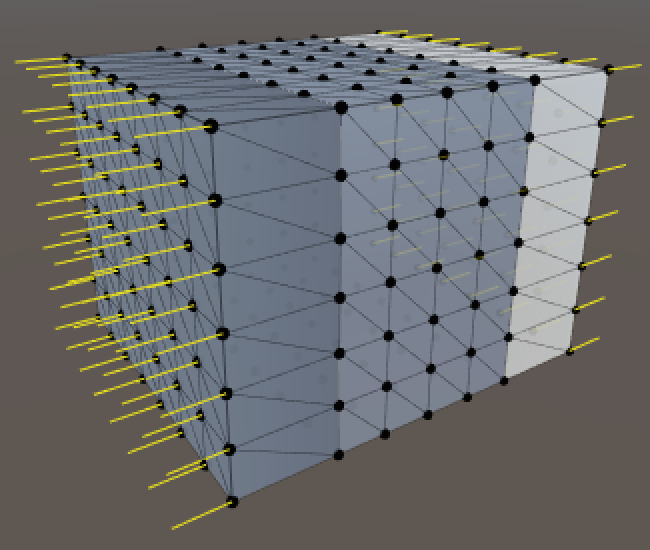

处理了X方向之后，结果看起来并不是很圆，但我们已经得到了正负X方向的法线。下面对Y坐标进行相同的检查。

```cs
		if (x < roundness) {
			inner.x = roundness;
		}
		else if (x > xSize - roundness) {
			inner.x = xSize - roundness;
		}
		if (y < roundness) {
			inner.y = roundness;
		}
		else if (y > ySize - roundness) {
			inner.y = ySize - roundness;
		}
```

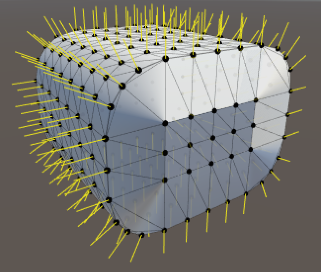

看起来圆角有点模样了！圆角度和法线在XY平面上起了作用，剩下的就是检查Z坐标了。

```cs
		if (x < roundness) {
			inner.x = roundness;
		}
		else if (x > xSize - roundness) {
			inner.x = xSize - roundness;
		}
		if (y < roundness) {
			inner.y = roundness;
		}
		else if (y > ySize - roundness) {
			inner.y = ySize - roundness;
		}
		if (z < roundness) {
			inner.z = roundness;
		}
		else if (z > zSize - roundness) {
			inner.z = zSize - roundness;
		}
```

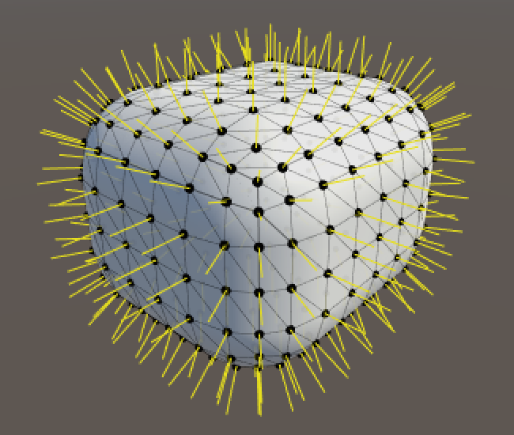

现在我们已经拥有了一个圆角立方体了。

## **5 分离mesh**

现在已经有一个很好的圆角立方体了，并且是用一个整体网格创建的，没有任何重复的顶点。

但是，这玩意应该怎么给它上纹理呢？我们需要使用UV坐标，但UV坐标没有办法创造一个无缝包装。而接缝又需要重复的顶点…好像又回到解放前了？

好吧，倒腾了这么久，还是需要切回之前的模式去，使用重复顶点吗？

其实还有另一种方法。我们可以使用多个子网格来创建使用相同顶点的独立三角形列表。这就可以让我们对每一组三角形使用不同的材质。

那么这里我们把网格分成三对对立面，但这意味着我们需要三个数组和三个三角形索引。

```cs
	private void CreateTriangles () {
		int[] trianglesZ = new int[(xSize * ySize) * 12];
		int[] trianglesX = new int[(ySize * zSize) * 12];
		int[] trianglesY = new int[(xSize * zSize) * 12];
		int ring = (xSize + zSize) * 2;
		int tZ = 0, tX = 0, tY = 0, v = 0;
		
		…
	}
```

现在，我们必须要将先前的循环分成四个部分，在Z和X的数组之间交替了。

```cs
		for (int y = 0; y < ySize; y++, v++) {
			for (int q = 0; q < xSize; q++, v++) {
				tZ = SetQuad(trianglesZ, tZ, v, v + 1, v + ring, v + ring + 1);
			}
			for (int q = 0; q < zSize; q++, v++) {
				tX = SetQuad(trianglesX, tX, v, v + 1, v + ring, v + ring + 1);
			}
			for (int q = 0; q < xSize; q++, v++) {
				tZ = SetQuad(trianglesZ, tZ, v, v + 1, v + ring, v + ring + 1);
			}
			for (int q = 0; q < zSize - 1; q++, v++) {
				tX = SetQuad(trianglesX, tX, v, v + 1, v + ring, v + ring + 1);
			}
			tX = SetQuad(trianglesX, tX, v, v - ring + 1, v + ring, v + 1);
		}
```

顶部和底部只使用Y数组。

```cs
		tY = CreateTopFace(trianglesY, tY, ring);
		tY = CreateBottomFace(trianglesY, tY, ring);
```

并且不再是给网格分配三角形，而是创建了三个子网格。

```cs
		mesh.subMeshCount = 3;
		mesh.SetTriangles(trianglesZ, 0);
		mesh.SetTriangles(trianglesX, 1);
		mesh.SetTriangles(trianglesY, 2);
```

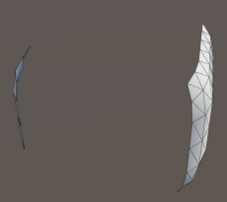

为什么只会显示两个面呢？这是因为网格现在被切割成三个部分了，而材质球只有1个，所以实际只有第一个被渲染了。要看到全部效果，必须为mesh renderer分配额外的材质球，每个子网格都要一个。这就是为什么会有一个物材质球的数组的原因。

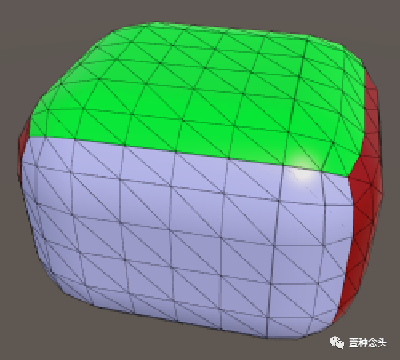

.png)

> 这会不会产生更多的draw calls？
>
> 的确如此，现在会有3个DC。所以你其实要知道哪个对你更重要，是更少的顶点还是更少的DC？

可能我们都希望要有较少的dc，但是这其实只有在dc是瓶颈的时候才应该关注。动态批处理有的时候也会帮你自动合并批次。

当你在一台CPU不太好的情况下，重复的顶点可能会对性能造成较大的影响，在这种情况下，顶点是越少越好，但是不重复的顶点又会要求你实现纹理包装的算法。

## **6 渲染网格**

虽然我们现在可以区分表面了，但我们仍然没有计算出纹理坐标。假设我们想要在整个立方体上显示一个网格模式，让我们可以看到各个正方形。我们如何才能做到这一点呢？


其实我们可以使用定制的着色器来解决如何应用纹理的问题，这样就不需要将UV坐标存储在mesh里了。下面是一个新创建的着色器。

```c
Shader "Custom/Rounded Cube Grid" {
	Properties {
		_Color ("Color", Color) = (1,1,1,1)
		_MainTex ("Albedo (RGB)", 2D) = "white" {}
		_Glossiness ("Smoothness", Range(0,1)) = 0.5
		_Metallic ("Metallic", Range(0,1)) = 0.0
	}
	SubShader {
		Tags { "RenderType"="Opaque" }
		LOD 200
		
		CGPROGRAM
		#pragma surface surf Standard fullforwardshadows
		#pragma target 3.0

		sampler2D _MainTex;

		struct Input {
			float2 uv_MainTex;
		};

		half _Glossiness;
		half _Metallic;
		fixed4 _Color;

		void surf (Input IN, inout SurfaceOutputStandard o) {
			fixed4 c = tex2D(_MainTex, IN.uv_MainTex) * _Color;
			o.Albedo = c.rgb;
			o.Metallic = _Metallic;
			o.Smoothness = _Glossiness;
			o.Alpha = c.a;
		}
		ENDCG
	} 
	FallBack "Diffuse"
}
```

这是默认的表面着色器。主要的一点是它定义了一个输入结构，并且期望传入主纹理的坐标。在surf函数中使用这些坐标，以便让每个呈现的片段都能调用它。

因为我们没有这样的坐标，所以我们必须用其他的东西来代替uv_mainTex。

```c
		struct Input {
			float2 cubeUV;
		};

		…

		void surf (Input IN, inout SurfaceOutputStandard o) {
			fixed4 c = tex2D(_MainTex, IN.cubeUV) * _Color;
			o.Albedo = c.rgb;
			o.Metallic = _Metallic;
			o.Smoothness = _Glossiness;
			o.Alpha = c.a;
		}
```

当UV被定义为每个顶点时，我们必须添加一个函数来调用每个顶点。

```c
		CGPROGRAM
		#pragma surface surf Standard fullforwardshadows vertex:vert
		#pragma target 3.0

		sampler2D _MainTex;

		struct Input {
			float2 cubeUV;
		};

		half _Glossiness;
		half _Metallic;
		fixed4 _Color;
		
		void vert (inout appdata_full v, out Input o) {
			UNITY_INITIALIZE_OUTPUT(Input, o);
		}

		void surf (Input IN, inout SurfaceOutputStandard o) {
			fixed4 c = tex2D(_MainTex, IN.cubeUV) * _Color;
			o.Albedo = c.rgb;
			o.Metallic = _Metallic;
			o.Smoothness = _Glossiness;
			o.Alpha = c.a;
		}
		ENDCG
```

要检查我们的着色器是否有效，首先直接使用顶点位置的XY坐标作为UV。

```c
		void vert (inout appdata_full v, out Input o) {
			UNITY_INITIALIZE_OUTPUT(Input, o);
			o.cubeUV = v.vertex.xy;
		}
```

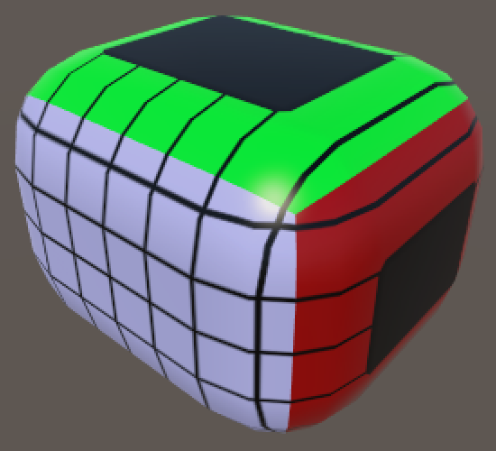

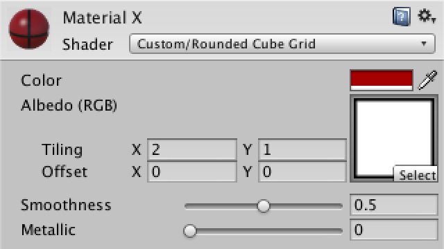

这个表现对Z面来说是合理的，但其他的则是非常糟糕。所以我们需要根据不同的面来使用不同的顶点坐标。可以通过添加关键字枚举着色器属性来支持这个选择。

```c
	Properties {
		_Color ("Color", Color) = (1,1,1,1)
		_MainTex ("Albedo (RGB)", 2D) = "white" {}
		_Glossiness ("Smoothness", Range(0,1)) = 0.5
		_Metallic ("Metallic", Range(0,1)) = 0.0
		[KeywordEnum(X, Y, Z)] _Faces ("Faces", Float) = 0
	}
```

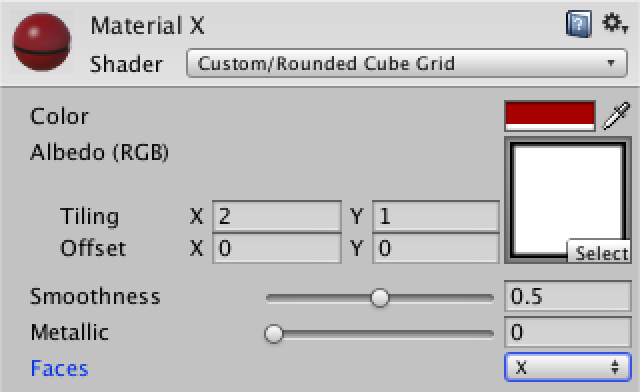

根据你选择的选项，Unity将为该材质启用自定义的着色器关键字。所以，我们必须告诉着色器给我们选择的每个枚举做不同的逻辑。

```c
	CGPROGRAM
		#pragma shader_feature _FACES_X _FACES_Y _FACES_Z
		#pragma surface surf Standard fullforwardshadows vertex:vert
		#pragma target 3.0
```

可以检查定义了哪个关键字，让我们能够为每个选项编写不同的代码。

```c
		void vert (inout appdata_full v, out Input o) {
			UNITY_INITIALIZE_OUTPUT(Input, o);
			#if defined(_FACES_X)
				o.cubeUV = v.vertex.yz;
			#elif defined(_FACES_Y)
				o.cubeUV = v.vertex.xz;
			#elif defined(_FACES_Z)
				o.cubeUV = v.vertex.xy;
			#endif
		}
```

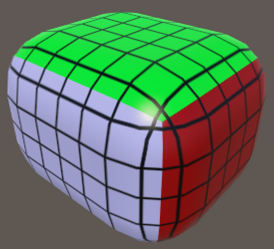

这看上去似乎已经不错了，但仔细看的话会发现网格线并不是实际的四边形。更糟糕的是，当我们使用世界空间的顶点位置时，一旦你移动或旋转立方体，渲染出来的表现会变得非常奇怪。

这时候我们需要在它被进行圆角化之前，得到原始立方体的顶点位置。如果能将它们存储在mesh中，就可以将它们传递给着色器了。

这当然也是能实现的，因为我们并没有使用顶点颜色，所以我们可以使用顶点颜色通道来达成这个目的。

> 为什么使用顶点色？
>
> 使用UV通道可能更有意义，但我们只能在其中放置2D矢量，而这里我们需要存储一个3D矢量。当然可以同时使用第一个和第二个UV通道，但之后我们必须将数据分成两个通道，这恰恰是我们想要避免的。
>
> 而切线向量是4D，我们也不使用它们。
>
> 那为什么不把数据放在切线通道上呢？这是因为切线--类似位置和法线--是在物体空间中定义的。这意味着当使用任何形式的批处理时，它们几乎都会被Unity所改变以保证正确的物体空间，批处理会将多个对象组合到一个单一的对象中。它一开始可能会起作用，但是当你的场景中有一个以上的圆形立方体时，奇怪的事情就会发生。

```cs
	private Color32[] cubeUV;

	private void CreateVertices () {
		int cornerVertices = 8;
		int edgeVertices = (xSize + ySize + zSize - 3) * 4;
		int faceVertices = (
			(xSize - 1) * (ySize - 1) +
			(xSize - 1) * (zSize - 1) +
			(ySize - 1) * (zSize - 1)) * 2;
		vertices = new Vector3[cornerVertices + edgeVertices + faceVertices];
		normals = new Vector3[vertices.Length];
		cubeUV = new Color32[vertices.Length];

		…

		mesh.vertices = vertices;
		mesh.normals = normals;
		mesh.colors32 = cubeUV;
	}

	private void SetVertex (int i, int x, int y, int z) {
		…

		normals[i] = (vertices[i] - inner).normalized;
		vertices[i] = inner + normals[i] * roundness;
		cubeUV[i] = new Color32((byte)x, (byte)y, (byte)z, 0);
	}
```

这里我们必须使用Color 32，而不是通常的Color类型，因为顶点颜色组件存储为一个字节。整个颜色是四个字节，大小与单个浮点数相同。如果我们使用常规颜色，那么Unity将从0-1浮点数转换为0-255字节，截断超出该范围的所有内容。通过自身直接转换为字节，我们可以处理高达255的多维数据集大小，这应该就足够了。在阴影方面，我们现在可以使用顶点的颜色，而不是它的位置。当着色器将顶点颜色通道解释为0-1范围内的值时，我们也必须通过乘以255来撤消这一转换才能得到正确的值。

```c
		void vert (inout appdata_full v, out Input o) {
			UNITY_INITIALIZE_OUTPUT(Input, o);
			#if defined(_FACES_X)
				o.cubeUV = v.color.yz * 255;
			#elif defined(_FACES_Y)
				o.cubeUV = v.color.xz * 255;
			#elif defined(_FACES_Z)
				o.cubeUV = v.color.xy * 255;
			#endif
		}
```

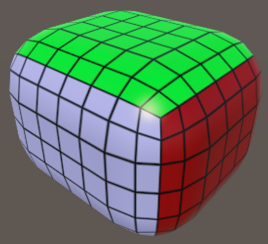

现在我们可以看到带纹理的圆角立方体了。但是要注意，每对表面的UV坐标都是镜像的，但这并不是问题，因为我们使用的也是对称的纹理。

## **7 添加碰撞**

只有当你能把立方体扔来扔去时，立方体才是有意思的，这就需要物理和碰撞。然而不幸的是，mesh collider。

起不了作用，因为你很快就会遇到凸碰撞体的多边形计数限制。但别担心，我们可以使用原始碰撞来创建一个完美的圆角立方体。

现在我们先给脚本增加一个方法：

```cs
	private void Generate () {
		GetComponent<MeshFilter>().mesh = mesh = new Mesh();
		mesh.name = "Procedural Cube";
		CreateVertices();
		CreateTriangles();
		CreateColliders();
	}
	
	private void CreateColliders () {
	}
```

作为第一步，添加一个独立的 box collider。

```c
	private void CreateColliders () {
		gameObject.AddComponent<BoxCollider>();
	}
```

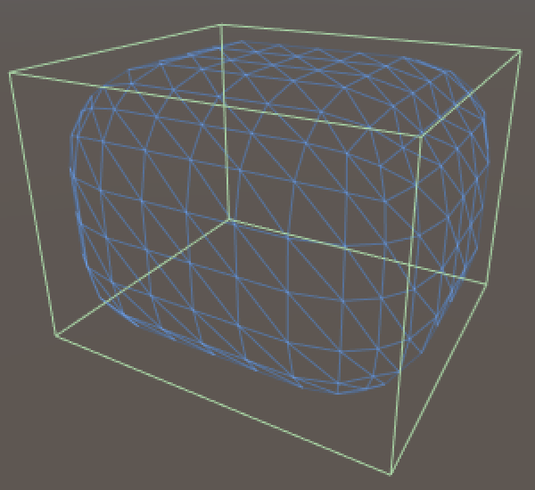

事实证明，Unity是足够睿智的来处理碰撞体的位置和缩放，以便它能匹配不同mesh的包围盒。现在，我们必须对对碰撞体进行缩放，使其与两个相对面的平边相匹配。由于这需要对所有三对表面，我们用三个相交块完成。

```cs
	private void CreateColliders () {
		AddBoxCollider(xSize, ySize - roundness * 2, zSize - roundness * 2);
		AddBoxCollider(xSize - roundness * 2, ySize, zSize - roundness * 2);
		AddBoxCollider(xSize - roundness * 2, ySize - roundness * 2, zSize);
	}
	
	private void AddBoxCollider (float x, float y, float z) {
		BoxCollider c = gameObject.AddComponent<BoxCollider>();
		c.size = new Vector3(x, y, z);
	}
```

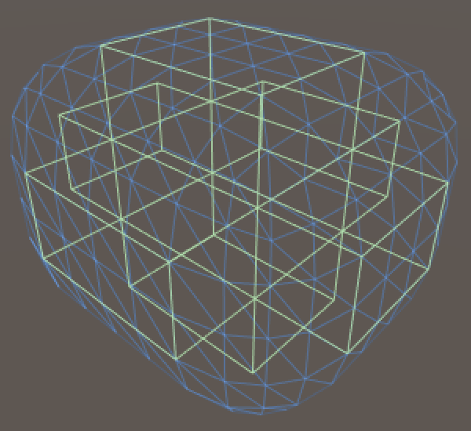

我们可以用胶囊填充边缘和角落。但是需要给他们正确的方向和位置，让它们在每一个边的中心。

```cs
	private void AddCapsuleCollider (int direction, float x, float y, float z) {
		CapsuleCollider c = gameObject.AddComponent<CapsuleCollider>();
		c.center = new Vector3(x, y, z);
		c.direction = direction;
		c.radius = roundness;
		c.height = c.center[direction] * 2f;
	}
```

因为每条边都需要一个胶囊，所以总共需要12个。这里创建了最小、一半半和最大向量，以使放置更容易一些。

```cs
	private void CreateColliders () {
		AddBoxCollider(xSize, ySize - roundness * 2, zSize - roundness * 2);
		AddBoxCollider(xSize - roundness * 2, ySize, zSize - roundness * 2);
		AddBoxCollider(xSize - roundness * 2, ySize - roundness * 2, zSize);

		Vector3 min = Vector3.one * roundness;
		Vector3 half = new Vector3(xSize, ySize, zSize) * 0.5f; 
		Vector3 max = new Vector3(xSize, ySize, zSize) - min;

		AddCapsuleCollider(0, half.x, min.y, min.z);
		AddCapsuleCollider(0, half.x, min.y, max.z);
		AddCapsuleCollider(0, half.x, max.y, min.z);
		AddCapsuleCollider(0, half.x, max.y, max.z);
		
		AddCapsuleCollider(1, min.x, half.y, min.z);
		AddCapsuleCollider(1, min.x, half.y, max.z);
		AddCapsuleCollider(1, max.x, half.y, min.z);
		AddCapsuleCollider(1, max.x, half.y, max.z);
		
		AddCapsuleCollider(2, min.x, min.y, half.z);
		AddCapsuleCollider(2, min.x, max.y, half.z);
		AddCapsuleCollider(2, max.x, min.y, half.z);
		AddCapsuleCollider(2, max.x, max.y, half.z);
	}
```

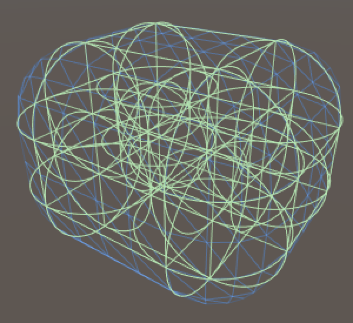

剩下的就是添加一个刚体到圆角立方体上了！那就给它一些嘛朋友！去吧，皮卡丘！

如果你已经熟练理解本章内容，就可以去下一篇，看一看 **立方体球** 的教程。

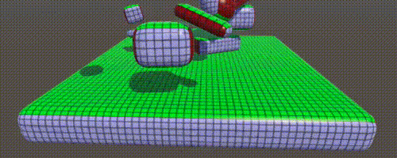