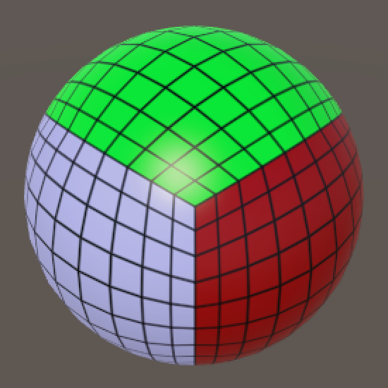

# Unity Mesh基础系列（三）立方体球（更好更圆）

[原文地址](https://catlikecoding.com/unity/tutorials/cube-sphere/)

[译文地址](https://mp.weixin.qq.com/s/yVDzc3XMyoXpUzirzr_30A)

> 本章重点：
>
> 1、把立方体变为球体
>
> 2、在Unity中可视化映射
>
> 3、分析换算的损耗
>
> 4、用数学优化算法

## **1 适配圆角立方体**

通过上一篇文章，其实你可能已经发现了，只要我们把它所有三维的尺寸设置一样，并把圆度值设置为纬度值的一半就能得到一个完美的球体了。

但如果你确实只想要一个球体，那么圆角立方体所提供的灵活度就不够用了。那么，这次让我们为这个需求创建一个单独的组件来实现。

复制RoundedCube脚本并将其重命名为CubeSphere。然后用一个 gridSize 替换这三个大小，并删除 roundness 字段。

```cs
public class CubeSphere : MonoBehaviour {

	public int gridSize;
	// No more roundness.

	private Mesh mesh;
	private Vector3[] vertices;
	private Vector3[] normals;
	private Color32[] cubeUV;
	
	…

	private void Generate () {
		GetComponent<MeshFilter>().mesh = mesh = new Mesh();
		mesh.name = "Procedural Sphere";
		CreateVertices();
		CreateTriangles();
		CreateColliders();
	}
	
	…
}
```

> 怎么快速的将3个字段替换成1个？
>
> 最方便的方法就是使用编辑器rename变量名，这会保证对它们的所有引用也被重命名。

比如，首先将xSize重命名为GridSize，然后对ySize和zSize执行相同的操作。或者，执行多个搜索和替换操作。

删除roundness字段肯定会导致一些编译错误，因为引用到它的地方还没有处理，删掉相关的引用即可。

然后，我们可以先创建一个碰撞体。上一章节，我们创建了多个box 和capsule （胶囊）碰撞体来表示圆角立方体，但是球体只需要一个球体立方体即可。这意味着我们可以删除AddBoxCollider和AddCapsuleCollider方法，并将CreateColliders简化为一行代码。

```
	private void CreateColliders () {
		gameObject.AddComponent<SphereCollider>();
	}
```

其次是顶点的位置，它也依赖于roundness字段。先前我们通过对向量设置法线的方法形成了圆角立方体的角，并且该向量从角的内部指向原始立方体的某个位置。但是当我们要处理成一个球体的时候，这就是我们唯一和必须要做的，因为其他的情况都会退化掉。

如果球体的坐标系是以它的局部原点为中心的话，会很方便的。我们不用再费时用内部的立方体和不同的圆以及网格来共同搭建mesh了。

要创建一个单位球体--半径为1单位的球体--首先需要规范位于原点中心的立方体的顶点，使立方体能准确地包含球体，那么它的边长就为2。


我们可以在 SetVertex 内创建这个立方体的顶点，方法是将原始坐标除以网格大小，缩放，然后减去单位向量。

```cs
	public float radius = 1;
	
	private void SetVertex (int i, int x, int y, int z) {
		Vector3 v = new Vector3(x, y, z) * 2f / gridSize - Vector3.one;
		normals[i] = v.normalized;
		vertices[i] = normals[i];
		cubeUV[i] = new Color32((byte)x, (byte)y, (byte)z, 0);
	}
```

这就产生了一个单位球体，但有的时候，可能需要一个不同的半径，所以让我们让它可以配置。

```cs
	public float radius = 1f;
	
	private void SetVertex (int i, int x, int y, int z) {
		Vector3 v = new Vector3(x, y, z) * 2f / gridSize - Vector3.one;
		normals[i] = v.normalized;
		vertices[i] = normals[i] * radius;
		cubeUV[i] = new Color32((byte)x, (byte)y, (byte)z, 0);
	}
```

现在，我们可以将一个立方体对象放到场景中，你可以从头开始自己按照教程写，或者直接用源码里提供的组件，替换圆角立方体对象的组件。


## **2 检查映射**

我们已经能创建一个球面的Mesh了，但是他们足够好吗？网格均匀吗？我们可以从不同的角度看一下。




*Different viewpoints, perspective and orthographic.*

从上面的展示可以看到，不同的网格单元差距还是很大的，最大的单元来自于球体（立方体）的中间，大小大约是角落的4倍。

想要知道为什么的话，我们需要把一个正方形到一个圆的映射进行可视化。之所以用圆举例子，因为它比球体更容易处理，而且概念相通。

我们可以通过一个带有OnDrawGizmosSelected方法的自定义组件，在Unity里创建一个可视化的gizmos。它的工作方式类似于OnDrawGizmos，但只是当对象被选中时才绘制。

向场景中添加一个可视化对象，一旦我们选中的话，就可以看到自定义的绘制。

```cs
using UnityEngine;

public class CircleGizmo : MonoBehaviour {

	private void OnDrawGizmosSelected () {
	}
}
```

我们用黑色球体显示正方形边缘的顶点，分辨率可以自定义。可以先画正方形的顶部和底部。

```cs
	public int resolution = 10;

	private void OnDrawGizmosSelected () {
		float step = 2f / resolution;
		for (int i = 0; i <= resolution; i++) {
			ShowPoint(i * step - 1f, -1f);
			ShowPoint(i * step - 1f, 1f);
		}
	}

	private void ShowPoint (float x, float y) {
		Vector2 square = new Vector2(x, y);

		Gizmos.color = Color.black;
		Gizmos.DrawSphere(square, 0.025f);
	}
```


补全左边和右边的边，因为角上的点我们已经划过了，所以可以省掉。

```cs
	private void OnDrawGizmosSelected () {
		float step = 2f / resolution;
		for (int i = 0; i <= resolution; i++) {
			ShowPoint(i * step - 1f, -1f);
			ShowPoint(i * step - 1f, 1f);
		}
		for (int i = 1; i < resolution; i++) {
			ShowPoint(-1f, i * step - 1f);
			ShowPoint(1f, i * step - 1f);
		}
	}
```


接下来，对于每一点，我们也将其映射到相应的圆边上，这里用白色的球表示。然后，我们用一条黄线展示了这两个顶点之间的关系。最后画一条从圆顶点到圆心的一条灰色线。

```cs
	private void ShowPoint (float x, float y) {
		Vector2 square = new Vector2(x, y);
		Vector2 circle = square.normalized;

		Gizmos.color = Color.black;
		Gizmos.DrawSphere(square, 0.025f);

		Gizmos.color = Color.white;
		Gizmos.DrawSphere(circle, 0.025f);

		Gizmos.color = Color.yellow;
		Gizmos.DrawLine(square, circle);

		Gizmos.color = Color.gray;
		Gizmos.DrawLine(circle, Vector2.zero);
	}
```


现在我们可以看到当前的映射是如何工作的了。法线化会把顶点直接拉往中心，直到它们到达单位圆的边为止。靠近正方形角的顶点比靠近主轴的顶点被拉得更多（黄色线段）。

实际上，完全位于主轴上的顶点根本不用移动，而完全位于对角线上的顶点则由√2-1 单元移动。

当所有的点被直接拉向同一个圆的边的时候，它们最终的位置会更加接近。这就是为什么接触对角线的单元网格是最小的。

## **3 用数学来玩**

现在我们知道，为什么这些单元网格的大小会出现这么大的偏差了。那么我们可以做些什么改进来让单元网格的生成更加均匀一些呢？或者说该怎么去找一个这样的映射呢？

这其实是一个数学问题，所以让我们可以从更正式地描述我们当前的映射开始入手。这一次仍然只用圆来举例，后面可以在进一步应用到球体上。

一个重要的步骤就是，我们需要把正方形上的点映射成圆上的点。当用向量描述点的时候，我们实际上是在将一个向量映射到另一个向量。

$$v_s → v_c$$

具体来说，我们的圆是单位圆，所以它的外切正方形的边长为2。因此，我们的映射只是它的法线化版本。

$$v_c = \hat{v}_s$$

将向量法线化是通过除以它自己的长度来完成的。

$$\hat{v}_s = \frac{v_s}{||v_s||}$$

那么又如何得到一个二维向量的长度呢？它由两个坐标组成。

$$v_s = \left[ \begin{matrix} x\\ y \end{matrix} \right]$$

这个坐标定义了一个直角三角形，你可以应用毕达哥拉斯定理。

$$||v_s||^2 = x^2 + y^2$$


向量的长度就是它的平方根。

$$||v_s|| = \sqrt{||v_s||^2} = \sqrt{x^2 + y^2}$$

现在，我们可以以最显示的方式完成映射。


能完成映射就因为完成了一大半，但是我们怎么证明vc vc定义了单位圆上的一个点呢？如果要使之成立，它的长度就必须是1，所以我们必须证明下面的等式是正确的。


这很难理解和使用，所以让我们把所有的变量就加个平方。


继续简化，让它变得易于理解。


由于最后表达式的分子和分母相等，并且结果必须是1。也就是说，除非$$x^2+y^2$$最终为零，在这种情况下，结果是未知的。但是我们只使用正方形边上的点作为输入，这保证了一个或两个坐标都是1或?1，也确保了$$x^2+y^2 \geq 1$$，所以我们并不会得到一个未定义的结果。

那么这个证据有用吗？

它向我们展示了一个公式，为我们的正方形上的每一点产生1。这个公式对应于从正方形到单位圆的映射。

我们能否找到一个不同的公式来做同样的事情呢？如果上面的公式成立，则一定有一个不同的映射！所以让我们逆转这个过程。给出一个公式，对我们平方上的每一点求出1。

如果尽量保持简单的话，这样的函数会是什么样子的呢？我们知道，至少有一个坐标总是?1或1。所以如果我们把这两个坐标都平方，我们至少可以得到一个1。或者，我们可以通过使用$$1 - x^2$$和$$1 - y^2$$将它们转换成零点。因为其中至少有一个总是零，如果我们把它们相乘，保证得到零。这就给了我们公式。

$$1 - (1 - x^2)(1 - y^2)$$

这个公式可以重写成更简单的形式。

$$1 - (1 - x^2)(1 - y^2) = x^2 + y^2 - x^2y^2$$

现在我们有了一种新的方法来定义vc vc的平方长度。


让我们重新排列这个方程的右边，它的形式是$$a+b$$。$$x^2$$和$$y^2$$的部分很明显，但是对$$x^2y^2$$部分有什么作用呢？保持事物尽可能对称是有意义的，所以要平均分配。


现在可以把它分成两个坐标，我们当然可以用不同的方式来分割它，但是这种方式会产生圆上点的最佳分布。现在，我们只是一个平方根远离最后的向量。


现在我们找到了一个从正方形到圆的向量的新映射。让我们在ShowPoint上试试吧！

```cs
		Vector2 circle;
		circle.x = square.x * Mathf.Sqrt(1f - square.y * square.y * 0.5f);
		circle.y = square.y * Mathf.Sqrt(1f - square.x * square.x * 0.5f);
```


结果表明，这种映射将点从对角线推到轴上。它们现在离轴最近。幸运的是，相邻点之间的距离比我们第一种方法得到的更均匀，所以这是一个改进。

## **4 调整映射**

现在已经有一个从正方形到圆形的新映射了，但是从一个立方体到另一个球呢？

是否能用同样的方法呢？结果是确定的，但是我们需要包含第三个坐标，就像我们已经有两个坐标一样。这样我们就可以得到指向单位球面上点的向量的平方长度。


事实上，它可以适用于任意数量的坐标，因此我们可以从任何超立方体映射到同一维的任何超球面上。但扩展公式会变得更复杂。


这个三维公式有一个新的$$x^2y^2z^2$$部分，它与所有三个坐标都有关联。和以前一样，我们把它平分到最后一个向量的坐标之间。我们最终得到了更复杂的公式，但概念保持不变。


最终的映射是平方根。


让我们在SetVertex中使用它，看看它是什么样子的！

```cs
private void SetVertex (int i, int x, int y, int z) {
		Vector3 v = new Vector3(x, y, z) * 2f / gridSize - Vector3.one;
		float x2 = v.x * v.x;
		float y2 = v.y * v.y;
		float z2 = v.z * v.z;
		Vector3 s;
		s.x = v.x * Mathf.Sqrt(1f - y2 / 2f - z2 / 2f + y2 * z2 / 3f);
		s.y = v.y * Mathf.Sqrt(1f - x2 / 2f - z2 / 2f + x2 * z2 / 3f);
		s.z = v.z * Mathf.Sqrt(1f - x2 / 2f - y2 / 2f + x2 * y2 / 3f);
		normals[i] = s;
		vertices[i] = normals[i] * radius;
		cubeUV[i] = new Color32((byte)x, (byte)y, (byte)z, 0);
	}
```


网格单元越接近对角线，扭曲程度就越大，这是无法避免的。

但是这种新的映射产生的单元比标准化方法具有更均匀的大小。轴角和立方体角上的单元格现在似乎大小大致相同。这比我们一开始要好得多了。现在最大的细胞是那些沿立方体边缘的单位网格。那些过去常常被压扁，但现在它们已经被拉伸了。

如果你现在想给这个漂亮的球一个很好的挤压变形，那么你现在可以转到 **[Mesh Deformation](https://catlikecoding.com/unity/tutorials/mesh-deformation/)** 教程。