# Unity Mesh基础系列（四）mesh变形（制作一个弹力球）

[原文地址](https://catlikecoding.com/unity/tutorials/mesh-deformation/)

[译文地址](https://mp.weixin.qq.com/s/yAOalf_APoiKgdVyZY0oNQ)

> 本章内容重点
>
> 向对象投射射线并绘制调试线。
>
> 将力转换为顶点速度。
>
> 用弹簧和阻尼保持形状。
>
> 补偿对象转换。

## **1 场景搭建**

我们会从一个以单个立方体球体为中心的场景开始。你既可以从头开始，也可以复用上一章 立方体球 的场景，然后删除所有多余的东西。

为了获得平滑的变形效果，球体应该包含相当数量的顶点。我把球体的网格大小设为20，半径设为1。

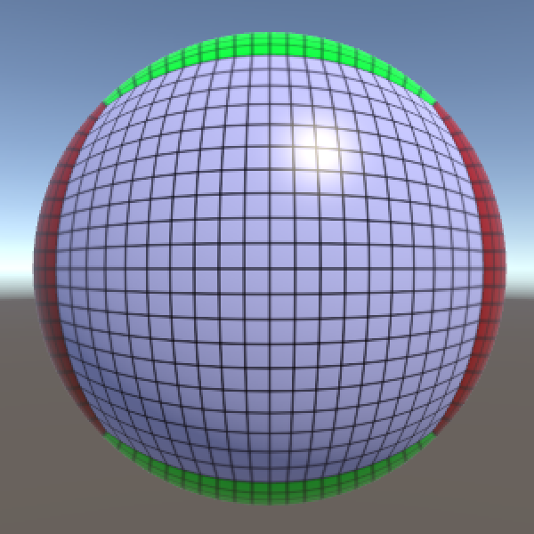

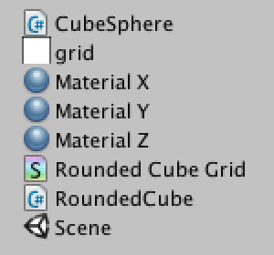

## **2 Mesh调节器**

创建一个新的MeshDeformer脚本来处理变形。就像立方体球面组件一样，它需要一个mesh filter组件来处理。

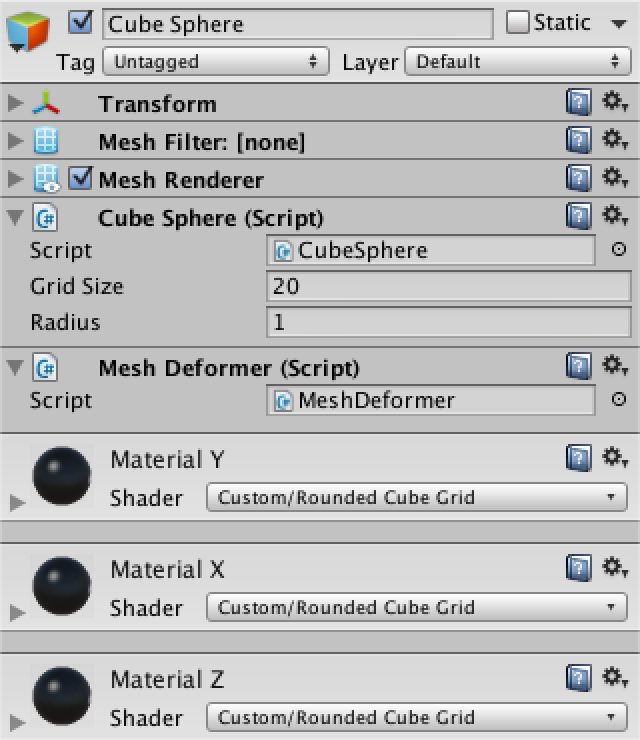

这里需要注意，和前面的章节不同，这里我们只需要mesh filter。这里我们不在乎它是如何得到网格数据的。而现在正在使用我们的程序生成的 立方体球，但其实它可以是任何网格。

### **2.1 准备**

要进行任何的变形，我们都需要访问Mesh。一旦我们有了Mesh，就可以提取到原始的顶点位置。除此之外，还必须跟踪变形过程中的位移点。

```cs
	Mesh deformingMesh;
	Vector3[] originalVertices, displacedVertices;
```

在Start方法中对网格及其顶点进行赋值，并将原始顶点复制到移位点。

```cs
	void Start () {
		deformingMesh = GetComponent<MeshFilter>().mesh;
		originalVertices = deformingMesh.vertices;
		displacedVertices = new Vector3[originalVertices.Length];
		for (int i = 0; i < originalVertices.Length; i++) {
			displacedVertices[i] = originalVertices[i];
		}
	}
```

之所以要使用Start，是因为我们需要在Awake时生成过程网格，因为Awake总是在Start前被调用。这种方法依赖于其他组件在Awake时处理好他们自身的东西，Awake本身的先后顺序并不能保证，所以你其实可以在Unity的设置里自己调节脚本执行顺序，以强制执行第一和最后的脚本。

### **2.2 顶点速度**

当网格变形是由顶点移动造成的。所以我们还必须存储每个顶点的速度。

```cs
	Vector3[] vertexVelocities;

	void Start () {
		…
		vertexVelocities = new Vector3[originalVertices.Length];
	}
```

这样我们就有了支持网格变形的基本成分了。

## **3 Mesh 调节器的输入**

我们需要一些手段来控制mesh如何变形，这里就要用到用户输入，也就是交互。不管什么时候用户触碰了物体，都会给这个点施加一个力。

**MeshDeformer** 类会处理实际的变形逻辑，但是它并不关心输入。我们需要创建另外一个单独的类来处理用户输入。给这个组件配置一个可以自定义输入的力变量。

```cs
using UnityEngine;

public class MeshDeformerInput : MonoBehaviour {

	public float force = 10f;
}
```

把这个组件附加到相机上，因为它代表了用户的视角关注点。绑在其他物体上也行，但不应该绑定到需要变形的网格对象上，因为场景中可能有很多网格对象。

.png)

### **3.1 输入检测**

当按住鼠标按钮时，我们就需要处理用户的输入。并根据后续的操作，可以得到点击或拖动操作。

```cs
	void Update () {
		if (Input.GetMouseButton(0)) {
			HandleInput();
		}
	}
```

拿到鼠标事件之后，还需要找出用户的指向位置。可以通过把镜头中的光线投射到场景中来实现这一点。通过抓取场景的主摄像机，并使用它将光标位置转换为光线。

```cs
	void HandleInput () {
		Ray inputRay = Camera.main.ScreenPointToRay(Input.mousePosition);
	}
```

使用物理引擎来投射射线并存储关于它碰撞信息。如果光线与某物发生接触，就可以从被击中的对象中检索 MeshDeformer 组件。

```cs
		Ray inputRay = Camera.main.ScreenPointToRay(Input.mousePosition);
		RaycastHit hit;

		if (Physics.Raycast(inputRay, out hit)) {
			MeshDeformer deformer = hit.collider.GetComponent<MeshDeformer>();
		}
```

> Physics.Raycast 是如何工作的？
>
> 这是一个静态的方法，用来把射线投影到3D的场景里。它有很多个变体方法，最简单的一个就是传递一个ray参数，然后返回是否击中了对象。
>我们使用的版本有一个附加参数。它是RaycastHit类型的输出参数。里面包含被击中的信息和接触点的结构。

### **3.2 施加力**

如果我们击中了一个物体，并且该某物有一个 MeshDeformer 组件的话，就可以使它变形了！因此，现在需要在接触点增加变形的力。

```cs
			MeshDeformer deformer = hit.collider.GetComponent<MeshDeformer>();
			if (deformer) {
				Vector3 point = hit.point;
				deformer.AddDeformingForce(point, force);
			}
```

当然，这段代码调用了 MeshDeformer 组件有AddDeformingForce方法。所以需要在相应的组件里添加这个方法。

不过，我们暂时不做任何变形。而是画一条调试线从主摄像机到点，以便以可视化的力的情况。

```cs
	public void AddDeformingForce (Vector3 point, float force) {
		Debug.DrawLine(Camera.main.transform.position, point);
	}
```

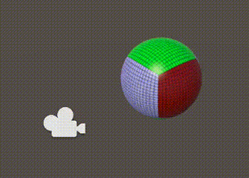

**3.3 力偏移**

我们想要实现的效果是网格被用户按压和凹陷。

这就需要将接触点附近的所有顶点推进表面里。然而，变形的力并没有指定内在的方向。它会平等地应用于各个方向。这将会导致平面上的顶点被向周围推开，而不是向内推。

通过将力点从表面拉出，我们可以增加一个方向。一个轻微的偏移就可以保证顶点总是被推入表面。而接触点处的法线正好可以作为偏移方向。

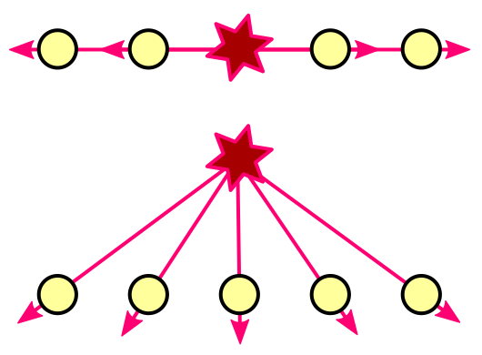

```cs
	public float forceOffset = 0.1f;

	void HandleInput () {
		Ray inputRay = Camera.main.ScreenPointToRay(Input.mousePosition);
		RaycastHit hit;

		if (Physics.Raycast(inputRay, out hit)) {
			MeshDeformer deformer = hit.collider.GetComponent<MeshDeformer>();
			if (deformer) {
				Vector3 point = hit.point;
				point += hit.normal * forceOffset;
				deformer.AddDeformingForce(point, force);
			}
		}
	}
```

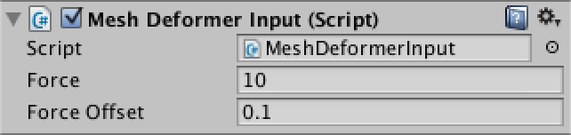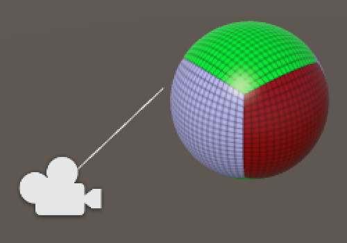

## **4 最基础的变形**

现在可以开始做一些变形效果了。**MeshDeformer** .AddDeformingForce 必须要循环遍历所有当前移位的顶点，并将变形力分别应用到每个顶点才可以。

```cs
	public void AddDeformingForce (Vector3 point, float force) {
		for (int i = 0; i < displacedVertices.Length; i++) {
			AddForceToVertex(i, point, force);
		}
	}

	void AddForceToVertex (int i, Vector3 point, float force) {
	}
```

### **4.1 将力转换为速度**

一个力被施加到网格的每个顶点之后，网格就会变形。当顶点被推入的时候，它们需要获得一个速度。随着时间的推移，顶点就会改变它们的位置。如果所有顶点都经历完全相同的力的话，整个物体就会移动而不改变其形状了。

想象一个爆炸。如果你在边上，就必死无疑。但如果你离的远些，可能会被气浪撞倒。而当你在很远的地方的时候就几乎受到影响。

也就是说，力是会随着距离的推移而减弱的。结合方位的差异，就会产生方向上的衰减，这也是造成物体变形的原理。

所以我们需要知道每个顶点变形力的方向和距离，而两者都可以从力点指向顶点位置的矢量导出。

```cs
	void AddForceToVertex (int i, Vector3 point, float force) {
		Vector3 pointToVertex = displacedVertices[i] - point;
	}
```

可以用[inverse-square law](https://en.wikipedia.org/wiki/Inverse-square_law)找到衰减力，只需将力除以距离平方即可。只是初始力除以距离平方，$$F_v = \frac{F}{d^2}$$而实际上，我除以1加上距离平方,$$F_v = \frac{F}{1 + d^2}$$这可以确保当距离为零的时候，力处于全力状态。否则，力就会在距离1的地方达到最大的强度，并且越靠近点，它就会朝无穷远的方向飞去。

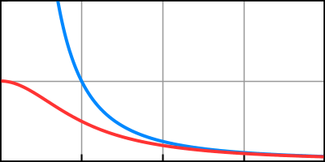

$$\frac{1}{x^2} and \frac{1}{1 + x^2}$$

```cs
		Vector3 pointToVertex = displacedVertices[i] - point;
		float attenuatedForce = force / (1f + pointToVertex.sqrMagnitude);
```

现在我们有了力，然后可以把它转换成速度。实际上，力首先通过$$a = \frac{F}{m}$$转化为加速度。然后加速度通过$$\Delta{v} = a\Delta{t}$$。为了计算简单，我们将忽略质量，就好像它是均匀分布的，每个顶点的都一样。所以最后的速度变化是：$$\Delta{v} = F\Delta{t}$$

```cs
		Vector3 pointToVertex = displacedVertices[i] - point;
		float attenuatedForce = force / (1f + pointToVertex.sqrMagnitude);
		float velocity = attenuatedForce * Time.deltaTime;
```

在该点上，我们已经有了一个速度了，但还没有方向。这可以通过规范最开始使用的法线向量来得到。然后我们可以把结果加到顶点速度上。

```cs
		Vector3 pointToVertex = displacedVertices[i] - point;
		float attenuatedForce = force / (1f + pointToVertex.sqrMagnitude);
		float velocity = attenuatedForce * Time.deltaTime;
		vertexVelocities[i] += pointToVertex.normalized * velocity;
```

### **4.2 移动顶点**

顶点有速度之后，我们就可以移动它们了。添加一个更新方法来处理每个顶点的位置。然后，将位移顶点分配给网格，使其实际发生变化。因为网格的形状不再是恒定的，我们也必须重新计算它的法线。

```cs
void Update () {
		for (int i = 0; i < displacedVertices.Length; i++) {
			UpdateVertex(i);
		}
		deformingMesh.vertices = displacedVertices;
		deformingMesh.RecalculateNormals();
	}
```

更新顶点是调整其位置可以通过：$$\Delta{p} = v\Delta{t}$$

```cs
	void UpdateVertex (int i) {
		Vector3 velocity = vertexVelocities[i];
		displacedVertices[i] += velocity * Time.deltaTime;
	}
```


>这些顶点会一直更新下去吗？
>
>是的，每个update 所有的顶点都被移位，然后分配给网格，然后法线被重新计算。即使没有施加力，因为这个函数就是每帧执行的。但是如果用户没有让网格变形，这个方法可以被认为是浪费性能。因此，只有当网格处于不断变形的时候，再使用这个方法。

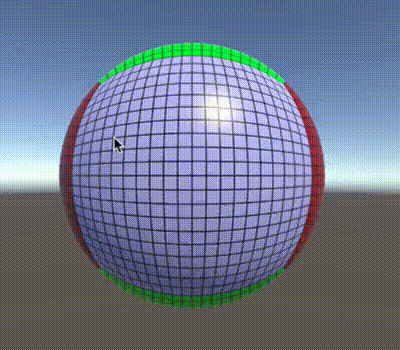

## **5 保持形状**

一旦我们对顶点施加了一些力，他们就会开始移动，但他们并不会停下来。如果它们不停地移动的话，物体的原始形状就会消失。现在我们来让物体进行回弹以恢复到原来的形状。

真实的固态物体，在变形的过程中会被压缩和拉伸，但是它们自身能抵抗这种变形。一旦不受干扰，就可以恢复到原来的形状。

而我们并没有真正的体积，只是一个描述表面的顶点集合而已。所以我们不能用它来进行真实的物理模拟。但这并不是问题，我们真正需要的是看上去像就可以了。

### **5.1 弹簧**

在前面，我们已经能跟踪到每个顶点的原始和变形位置。假设我们在每个顶点的两个版本之间附加一个弹簧。每当变形的顶点被移离原始顶点时，弹簧就会把它拉回来。变形顶点越远，弹簧的拉力就越大。

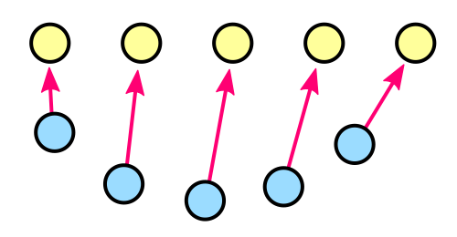

我们可以直接利用位移矢量作为速度调整，乘以一个可配置的弹簧力。简单，并且听上去也不错。

```cs
	public float springForce = 20f;
	
	void UpdateVertex (int i) {
		Vector3 velocity = vertexVelocities[i];
		Vector3 displacement = displacedVertices[i] - originalVertices[i];
		velocity -= displacement * springForce * Time.deltaTime;
		vertexVelocities[i] = velocity;
		displacedVertices[i] += velocity * Time.deltaTime;
	}
```

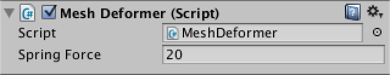

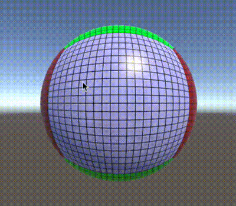

### **5.2 阻尼**

顶点现在抵抗变形，跳回原来的位置了。但是他们跳得太快了，而且不停地弹。这是因为弹簧力一直在拉它，而顶点却在自我校正，从而提高了它的速度。而且它只有在向后移动很远后才会减速。

这里可以通过不断地减缓顶点的速度来防止这种永恒的振荡。这种阻尼效应可以替代电阻、阻力、惯性等。是一个简单的因素，它会随着时间的推移而降低速度。

$v_d = v(1 - d\Delta{t})$

阻尼越高，物体的弹性就越小，表现的速度也就越慢。

```cs
public float damping = 5f;
	
	void UpdateVertex (int i) {
		Vector3 velocity = vertexVelocities[i];
		Vector3 displacement = displacedVertices[i] - originalVertices[i];
		velocity -= displacement * springForce * Time.deltaTime;
		velocity *= 1f - damping * Time.deltaTime;
		vertexVelocities[i] = velocity;
		displacedVertices[i] += velocity * Time.deltaTime;
	}
```

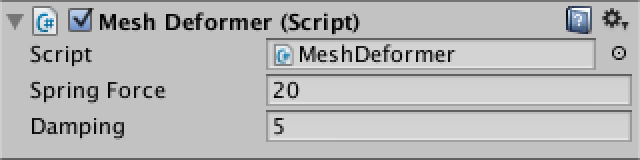

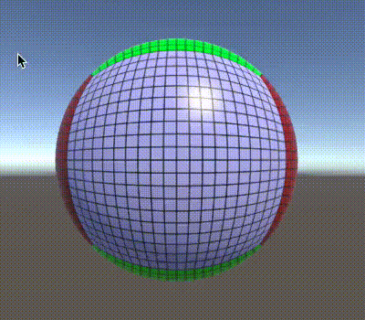

## **6 处理变换**

网格变形的功能现在是完整的了。但是如果我们要对物体的transform进行变换的话，还需要一些些处理。现在所有的计算都是在局部空间进行的。移动或旋转我们的球体。你会发现变形力会被不正确地施加。

我们必须补偿物体的transformation。通过将变形力的位置从世界空间转换到局部空间来实现这一点。


```cs
	public void AddDeformingForce (Vector3 point, float force) {
		point = transform.InverseTransformPoint(point);
		for (int i = 0; i < displacedVertices.Length; i++) {
			AddForceToVertex(i, point, force);
		}
	}
```

### **6.1 调整缩放**

力现在被施加在正确的位置，但是其他的地方仍然是错误的。向上或向下均匀地缩放球体。你会注意到变形鳞片的数量是一样的。但这是不对的。小的和大的物体应该受到同样的物理的影响才对。

所以过程中就必须补偿对象的缩放。首先，我们需要知道它的统一缩放值。这可以通过检查一个transform的local scale轴来找到。而且每次更新都要这么做，这样我们就可以在某种程度上处理那些动态改变其规模的对象了。

```cs
	float uniformScale = 1f;
	
	void Update () {
		uniformScale = transform.localScale.x;
		…
	}
```

> 如果不统一的缩放该怎么办？
>
> 你可以用一个3D向量代替一个单一的值。然后分别调整每个维度的补偿。但实际上，你不会想处理不均匀的尺度。


现在修正 AddForceToVertex ，方法是通过统一标度缩放点 pointToVertex 。这确保了我们使用正确的距离。

```cs
	void AddForceToVertex (int i, Vector3 point, float force) {
		Vector3 pointToVertex = displacedVertices[i] - point;
		pointToVertex *= uniformScale;
		float attenuatedForce = force / (1f + pointToVertex.sqrMagnitude);
		float velocity = attenuatedForce * Time.deltaTime;
		vertexVelocities[i] += pointToVertex.normalized * velocity;
	}
```

对于一个没有缩放的物体，我们的速度现在是正确的。但由于我们的对象实际上是缩放的，我们也必须调整顶点的运动。这一次我们需要除以它，而不是乘。

```cs
		displacedVertices[i] += velocity * (Time.deltaTime / uniformScale);
```

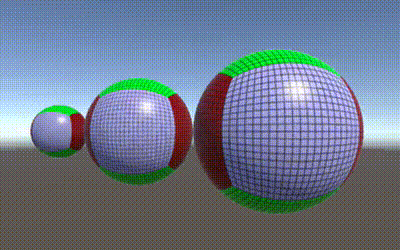

现在所有工作都完成了。在任意位置、旋转和均匀比例上都能正常展示的变形网格。请记住，这是一个简单和相对廉价的视觉效果。这并不是一个软体物理模拟。物体的碰撞也不会改变，所以物理引擎还是不知道物体的形状的。